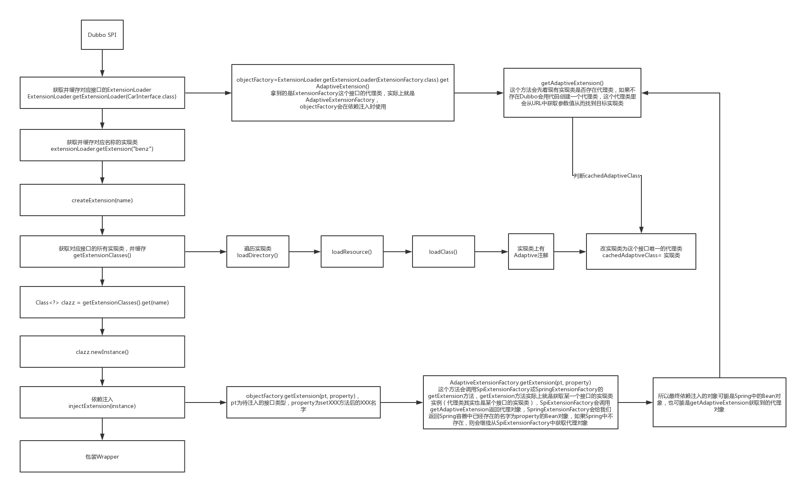

[TOC]

# 使用 Dubbo SPI 示例

这个Demo就是Dubbo常见的写法，表示获取"dubbo"对应的Protocol扩展点实现类，其中Protocol是一个接口

```java
ExtensionLoader<Protocol> extensionLoader = ExtensionLoader.getExtensionLoader(Protocol.class);
Protocol http = extensionLoader.getExtension("dubbo");
System.out.println(http);
```

# ExtensionLoader扩展点加载器

ExtensionLoader表示某个接口的扩展点加载器，可以用来加载某个扩展点实例。在ExtensionLoader类的内部有一个static的ConcurrentHashMap，用来缓存某个接口类型所对应的ExtensionLoader实例

```java
public static <T> ExtensionLoader<T> getExtensionLoader(Class<T> type) {
    if (type == null) {
        throw new IllegalArgumentException("Extension type == null");
    }
    if (!type.isInterface()) {
        throw new IllegalArgumentException("Extension type (" + type + ") is not an interface!");
    }
    if (!withExtensionAnnotation(type)) {
        throw new IllegalArgumentException("Extension type (" + type +
                ") is not an extension, because it is NOT annotated with @" + SPI.class.getSimpleName() + "!");
    }

    //对每个 type 类型创建一个ExtensionLoader对象进行缓存
    ExtensionLoader<T> loader = (ExtensionLoader<T>) EXTENSION_LOADERS.get(type);
    if (loader == null) {
        EXTENSION_LOADERS.putIfAbsent(type, new ExtensionLoader<T>(type));
        loader = (ExtensionLoader<T>) EXTENSION_LOADERS.get(type);
    }
    return loader;
}
```

在ExtensionLoader中除开有上文的static的Map外，还有两个非常重要的属性：

1. **Class type：**表示当前ExtensionLoader实例是哪个接口的扩展点加载器
2. **ExtensionFactory objectFactory：**扩展点工厂（对象工厂），可以获得某个对象。并且是通过自适应扩展实现获取的该对象

```java
private ExtensionLoader(Class<?> type) {
    this.type = type;
    // objectFactory表示当前ExtensionLoader内部的一个对象工厂，可以用来获取对象  AdaptiveExtensionFactory
    objectFactory = (type == ExtensionFactory.class ? null : ExtensionLoader.getExtensionLoader(ExtensionFactory.class).getAdaptiveExtension());
}
```


**ExtensionLoader**和**ExtensionFactory**的区别在于：

1. ExtensionLoader最终所得到的对象是Dubbo SPI机制产生的
2. ExtensionFactory最终所得到的对象可能是Dubbo SPI机制所产生的，也可能是从Spring容器中所获得的对象。该对象在进行扩展类IOC 实现时会用到

在**ExtensionLoader**中有三个常用的方法：

1. **getExtension("dubbo")：**表示获取名字为dubbo的扩展点实例
2. **getAdaptiveExtension()：**表示获取一个自适应的扩展点实例
3. **getActivateExtension(URL url, String[] values, String group)：**表示一个可以被url激活的扩展点实例

# 创建扩展实现类流程

核心流程：

1. 根据name找到对应的扩展点实现类
2. 根据实现类通过反射生成一个实例，把**实现类和对应生成的实例**进行缓存
3. 对生成出来的实例进行依赖注入（给实例的属性进行赋值）
4. 对依赖注入后的实例进行AOP（Wrapper）,把当前接口类的所有的Wrapper全部一层一层包裹在实例对象上，没包裹个Wrapper后，也会对Wrapper对象进行依赖注入
5. 返回最终的Wrapper对象

```java
public T getExtension(String name) {
    if (StringUtils.isEmpty(name)) {
        throw new IllegalArgumentException("Extension name == null");
    }
    // name为空或者是 true，则获取默认扩展实现类
    if ("true".equals(name)) {
        return getDefaultExtension();
    }

    //从缓存获取持有目标对象
    final Holder<Object> holder = getOrCreateHolder(name);
    //之所以用Holder对象包装一下，是为了下面进行synchronized同步，否则 null 无法同步
    Object instance = holder.get();

    // 如果有两个线程同时来获取同一个name的扩展点对象，那只会有一个线程会进行创建
    if (instance == null) {
        // 一个name对应一把锁
        synchronized (holder) {
            instance = holder.get();
            if (instance == null) {
                // 创建扩展点实例对象
                instance = createExtension(name);
                holder.set(instance);
            }
        }
    }
    return (T) instance;
}
```

```java
private T createExtension(String name) {
    // 对当前type类型的资源文件进行加载
    // 每个实现类加载完成后用 Class 对象表示
    // 这里获取指定名称的实现类 Class
    Class<?> clazz = getExtensionClasses().get(name);
    if (clazz == null) {
        throw findException(name);
    }

    try {
        // 实例缓存
        T instance = (T) EXTENSION_INSTANCES.get(clazz);
        if (instance == null) {
            // 通过反射创建实例
            EXTENSION_INSTANCES.putIfAbsent(clazz, clazz.newInstance());
            instance = (T) EXTENSION_INSTANCES.get(clazz);
        }

        //  setter依赖注入 IOC
        injectExtension(instance);

        // 如果有包装类则进行包装处理 AOP
        Set<Class<?>> wrapperClasses = cachedWrapperClasses;
        if (CollectionUtils.isNotEmpty(wrapperClasses)) {
            for (Class<?> wrapperClass : wrapperClasses) {
                //将对象传入 wrapper 对象的构造方法，再返回 wrapper 对象
                instance = injectExtension((T) wrapperClass.getConstructor(type).newInstance(instance));
            }
        }
        return instance;
    } catch (Throwable t) {
        throw new IllegalStateException("Extension instance (name: " + name + ", class: " +
                type + ") couldn't be instantiated: " + t.getMessage(), t);
    }
}
```

## 加载扩展实现类 Class

getExtensionClasses()是用来加载当前接口所有的扩展点实现类的，返回一个Map。之后可以从这个Map中按照指定的name获取对应的扩展点实现类。

当把当前接口的所有扩展点实现类都加载出来后也会进行缓存，下次需要加载时直接拿缓存中的

```java
private Map<String, Class<?>> getExtensionClasses() {
    Map<String, Class<?>> classes = cachedClasses.get();
    if (classes == null) {
        synchronized (cachedClasses) {
            classes = cachedClasses.get();
            if (classes == null) {
                // 对指定资源文件进行加载解析，最终用 Class 表示每个实现类
                // 并且每个实现类都有对应名称，后续可以按需使用
                classes = loadExtensionClasses();
                cachedClasses.set(classes);
            }
        }
    }
    return classes;
}
```

```java
private Map<String, Class<?>> loadExtensionClasses() {
    // cache接口默认的扩展类
    cacheDefaultExtensionName();

    Map<String, Class<?>> extensionClasses = new HashMap<>();
    //META-INF/dubbo/internal/目录下获取指定类型的文件资源，加载为对应的 Class
    loadDirectory(extensionClasses, DUBBO_INTERNAL_DIRECTORY, type.getName());
    loadDirectory(extensionClasses, DUBBO_INTERNAL_DIRECTORY, type.getName().replace("org.apache", "com.alibaba"));
    //从META-INF/dubbo/目录下获取指定类型的文件资源，加载为对应的 Class
    loadDirectory(extensionClasses, DUBBO_DIRECTORY, type.getName());
    loadDirectory(extensionClasses, DUBBO_DIRECTORY, type.getName().replace("org.apache", "com.alibaba"));
    //从META-INF/services/目录下获取指定类型的文件资源，加载为对应的 Class
    loadDirectory(extensionClasses, SERVICES_DIRECTORY, type.getName());
    loadDirectory(extensionClasses, SERVICES_DIRECTORY, type.getName().replace("org.apache", "com.alibaba"));
    return extensionClasses;
}
```

## 标记默认扩展实现类

从@SPI 注解上获取value值，代表默认的扩展实现类的名称。并赋值给cachedDefaultName。也就是在最开始可以通过getDefaultExtension获取的默认扩展实现类

```java
private void cacheDefaultExtensionName() {
    final SPI defaultAnnotation = type.getAnnotation(SPI.class);
    if (defaultAnnotation == null) {
        return;
    }

    String value = defaultAnnotation.value();
    if ((value = value.trim()).length() > 0) {
        String[] names = NAME_SEPARATOR.split(value);
        if (names.length > 1) {
            throw new IllegalStateException("More than 1 default extension name on extension " + type.getName()
                    + ": " + Arrays.toString(names));
        }
        if (names.length == 1) {
            cachedDefaultName = names[0];
        }
    }
}
```

## 从指定文件目录下加载 Class

从上述内置的文件目录下，进行扫描，加载扩展实现类

```java
private void loadDirectory(Map<String, Class<?>> extensionClasses, String dir, String type) {
    String fileName = dir + type;
    try {
        // 根据文件中的内容得到urls， 每个url表示一个扩展    http=org.apache.dubbo.rpc.protocol.http.HttpProtocol
        Enumeration<java.net.URL> urls;
        ClassLoader classLoader = findClassLoader();
        if (classLoader != null) {
            urls = classLoader.getResources(fileName);
        } else {
            urls = ClassLoader.getSystemResources(fileName);
        }
        if (urls != null) {
            while (urls.hasMoreElements()) {
                java.net.URL resourceURL = urls.nextElement();
                // 遍历url进行加载,把扩展类添加到extensionClasses中
                loadResource(extensionClasses, classLoader, resourceURL);
            }
        }
    } catch (Throwable t) {
        logger.error("Exception occurred when loading extension class (interface: " +
                type + ", description file: " + fileName + ").", t);
    }
}
```

loadResource方法就是完成对文件内容的解析，按行进行解析，会解析出**"="**两边的内容，"="左边的内容就是扩展点的name，右边的内容就是扩展点实现类全限定名，并且会利用ExtensionLoader类的类加载器来加载扩展点实现类，最终用 Class 对象来表示

```java
private void loadResource(Map<String, Class<?>> extensionClasses, ClassLoader classLoader, java.net.URL resourceURL) {
    try {
        try (BufferedReader reader = new BufferedReader(new InputStreamReader(resourceURL.openStream(), StandardCharsets.UTF_8))) {
            String line;
            while ((line = reader.readLine()) != null) {
                final int ci = line.indexOf('#');
                if (ci >= 0) {
                    line = line.substring(0, ci);
                }
                line = line.trim();
                if (line.length() > 0) {
                    try {
                        String name = null;
                        int i = line.indexOf('=');
                        if (i > 0) {
                            //一行的 key
                            name = line.substring(0, i).trim();
                            //一行的 value
                            line = line.substring(i + 1).trim();
                        }
                        if (line.length() > 0) {
                            // 加载类，并添加到extensionClasses中
                            // 将 value 进行类加载
                            loadClass(extensionClasses, resourceURL, Class.forName(line, true, classLoader), name);
                        }
                    } catch (Throwable t) {
                        IllegalStateException e = new IllegalStateException("Failed to load extension class (interface: " + type + ", class line: " + line + ") in " + resourceURL + ", cause: " + t.getMessage(), t);
                        exceptions.put(line, e);
                    }
                }
            }
        }
    } catch (Throwable t) {
        logger.error("Exception occurred when loading extension class (interface: " +
                type + ", class file: " + resourceURL + ") in " + resourceURL, t);
    }
}
```

根据从文件加载的 Class 对象进行处理，分别有 @Adaptive 、WrapperClass 和普通类这三种，普通类又将@Activate记录了一下。最终通过名称-->Class 保存到extensionClasses的 Map 类型数据结构中

1. 当前扩展点实现类上是否存在@Adaptive注解，如果存在则把该类认为是当前接口的默认自适应类（接口代理类），并把该类存到cachedAdaptiveClass属性上。
2. 当前扩展点实现是否是一个当前接口的一个Wrapper类，如果判断的？就是看当前类中是否存在一个构造方法，该构造方法只有一个参数，参数类型为接口类型，如果存在这一的构造方法，那么这个类就是该接口的Wrapper类，如果是，则把该类添加到cachedWrapperClasses中去， cachedWrapperClasses是一个set。
3. 如果不是自适应类，或者也不是Wrapper类，则判断是有存在name，如果没有name，则报错。
4. 如果有多个name，则判断一下当前扩展点实现类上是否存在@Activate注解，如果存在，则把该类添加到cachedActivates中，cachedActivates是一个map**。**
5. 最后，遍历多个name，把每个name和对应的实现类存到extensionClasses中去，extensionClasses就是上文所提到的map

```java
private void loadClass(Map<String, Class<?>> extensionClasses, java.net.URL resourceURL, Class<?> clazz, String name) throws NoSuchMethodException {
    if (!type.isAssignableFrom(clazz)) {
        throw new IllegalStateException("Error occurred when loading extension class (interface: " +
                type + ", class line: " + clazz.getName() + "), class "
                + clazz.getName() + " is not subtype of interface.");
    }
    // 如果类添加了Adaptive注解，则保存一下
    if (clazz.isAnnotationPresent(Adaptive.class)) {
        cacheAdaptiveClass(clazz);
    } else if (isWrapperClass(clazz)) {
        // 如果存在只有一个当前类型的参数的构造方法则认为是 Wrapper 类，保存一下
        cacheWrapperClass(clazz);
    } else {
        // 普通类
        // 需要有无参的构造方法
        clazz.getConstructor();

        // 在文件中没有name，但是在类上指定了Extension的注解上指定了name
        if (StringUtils.isEmpty(name)) {
            name = findAnnotationName(clazz);
            if (name.length() == 0) {
                throw new IllegalStateException("No such extension name for the class " + clazz.getName() + " in the config " + resourceURL);
            }
        }

        //可以是逗号隔开的多个 key
        String[] names = NAME_SEPARATOR.split(name);
        if (ArrayUtils.isNotEmpty(names)) {
            // 缓存一下被Activate注解了的类
            cacheActivateClass(clazz, names[0]);

            // 有多个名字
            for (String n : names) {
                // clazz: name
                cacheName(clazz, n);
                // name: clazz
                //保存名字到类映射到extensionClasses中
                saveInExtensionClass(extensionClasses, clazz, n);
            }
        }
    }
}
```

# 通过IOC依赖注入属性

核心流程：

1. 根据当前实例的类，找到这个类中的setter方法，进行依赖注入
2. 先分析出setter方法的参数类型pt
3. 在截取出setter方法所对应的属性名property
4. 调用**objectFactory**.getExtension(pt, property)得到一个对象，这里就会从Spring容器或通过DubboSpi机制得到一个对象，比较特殊的是，如果是通过DubboSpi机制得到的对象，是pt这个类型的一个自适应对象(代理对象)。
5. 再反射调用setter方法进行注入

```java
private T injectExtension(T instance) {

    if (objectFactory == null) {
        return instance;
    }

    try {
        //只处理对象上的 set 方法
        //并且 set 方法是 publi，只有一个参数
        for (Method method : instance.getClass().getMethods()) {
            if (!isSetter(method)) {
                continue;
            }

            // 利用set方法注入

            /**
             * Check {@link DisableInject} to see if we need auto injection for this property
             */
            if (method.getAnnotation(DisableInject.class) != null) {
                continue;
            }

            // set方法中的参数类型
            Class<?> pt = method.getParameterTypes()[0];
            if (ReflectUtils.isPrimitives(pt)) {
                continue;
            }

            try {
                // 得到setXxx方法名中的xxx
                String property = getSetterProperty(method);

                // 根据参数类型或属性名，从objectFactory中获取到对象，然后调用set方法进行注入
                // 这里注入的对象可能是 spring 容器中获取的，也可能是 Dubbo 生成的代理对象
                // AdaptiveExtensionFactory
                Object object = objectFactory.getExtension(pt, property); // User.class, user
                if (object != null) {
                    method.invoke(instance, object);
                }
            } catch (Exception e) {
                logger.error("Failed to inject via method " + method.getName()
                        + " of interface " + type.getName() + ": " + e.getMessage(), e);
            }

        }
    } catch (Exception e) {
        logger.error(e.getMessage(), e);
    }
    return instance;
}
```

# ExtensionFactory自适应扩展点的创建

上述进行 IOC 属性注入的过程中，需要注入的对象是通过objectFactory获取的，而该对象是ExtensionLoader类型的自适应扩展实现

需要注意的是在META-INF/dubbo/internal/org.apache.dubbo.common.extension.ExtensionFactory下配置了

```java
adaptive=org.apache.dubbo.common.extension.factory.AdaptiveExtensionFactory
spi=org.apache.dubbo.common.extension.factory.SpiExtensionFactory
```

AdaptiveExtensionFactory实现类有@Adaptive 注解，默认就是自适应扩展实现类

# AdaptiveExtensionFactory创建代理对象

```java
@Adaptive
public class AdaptiveExtensionFactory implements ExtensionFactory {

    private final List<ExtensionFactory> factories;

    public AdaptiveExtensionFactory() {
        // 支持哪些ExtensionFactory (Spi, SPring)
        ExtensionLoader<ExtensionFactory> loader = ExtensionLoader.getExtensionLoader(ExtensionFactory.class);

        List<ExtensionFactory> list = new ArrayList<ExtensionFactory>();

        for (String name : loader.getSupportedExtensions()) { // spi, spring
            list.add(loader.getExtension(name));
        }
        factories = Collections.unmodifiableList(list);
    }

    @Override
    public <T> T getExtension(Class<T> type, String name) {
        // 遍历两个ExtensionFactory，从ExtensionFactory中得到实例，只要从某个ExtensionFactory中获取到对象实例就可以了
        for (ExtensionFactory factory : factories) {
            T extension = factory.getExtension(type, name);  // SpringExtensionFactory, SpiExtensionFactory
            if (extension != null) {
                return extension;
            }
        }
        return null;
    }

}
```

## SpiExtensionFactory生成代理对象注入

如果类上有 SPI 注解，则创建代理对象

```java
public class SpiExtensionFactory implements ExtensionFactory {

    @Override
    public <T> T getExtension(Class<T> type, String name) {


        // 接口上存在SPI注解
        if (type.isInterface() && type.isAnnotationPresent(SPI.class)) {
            ExtensionLoader<T> loader = ExtensionLoader.getExtensionLoader(type);

            if (!loader.getSupportedExtensions().isEmpty()) {
                // 接口的Adaptive类（代理对象）
                return loader.getAdaptiveExtension();
            }
        }
        return null;
    }

}
```

## SpringExtensionFactory从 Spring 容器注入

从 Spring 容器中获取的对象，是先通过 byName 再通过 byType 方式

```java
public class SpringExtensionFactory implements ExtensionFactory {
    ...
    // 从Spring容器中获取bean
    // 先根据name拿，再根据类型拿
    @Override
    @SuppressWarnings("unchecked")
    public <T> T getExtension(Class<T> type, String name) {

        //SPI should be get from SpiExtensionFactory
        // 如果接口上存在SPI注解，就不从spring中获取对象实例了
        if (type.isInterface() && type.isAnnotationPresent(SPI.class)) {
            return null;
        }

        // 从ApplicationContext中获取bean, byname
        for (ApplicationContext context : CONTEXTS) {
            if (context.containsBean(name)) {
                Object bean = context.getBean(name);
                if (type.isInstance(bean)) {
                    return (T) bean;
                }
            }
        }

        logger.warn("No spring extension (bean) named:" + name + ", try to find an extension (bean) of type " + type.getName());

        if (Object.class == type) {
            return null;
        }

        // byType
        for (ApplicationContext context : CONTEXTS) {
            try {
                return context.getBean(type);
            } catch (NoUniqueBeanDefinitionException multiBeanExe) {
                logger.warn("Find more than 1 spring extensions (beans) of type " + type.getName() + ", will stop auto injection. Please make sure you have specified the concrete parameter type and there's only one extension of that type.");
            } catch (NoSuchBeanDefinitionException noBeanExe) {
                if (logger.isDebugEnabled()) {
                    logger.debug("Error when get spring extension(bean) for type:" + type.getName(), noBeanExe);
                }
            }
        }

        logger.warn("No spring extension (bean) named:" + name + ", type:" + type.getName() + " found, stop get bean.");

        return null;
    }
}
```

# Adaptive自适应扩展点

什么是**自适应扩展点实例**？它其实就是当前这个接口的一个**代理对象**


通过扩展类加载器的getAdaptiveExtension方法获取的是自适应扩展类

```java
public T getAdaptiveExtension() {
    Object instance = cachedAdaptiveInstance.get();
    if (instance == null) {
        if (createAdaptiveInstanceError != null) {
            throw new IllegalStateException("Failed to create adaptive instance: " +
                    createAdaptiveInstanceError.toString(),
                    createAdaptiveInstanceError);
        }

        synchronized (cachedAdaptiveInstance) {
            instance = cachedAdaptiveInstance.get();
            if (instance == null) {
                try {
                    //创建对象
                    instance = createAdaptiveExtension();
                    cachedAdaptiveInstance.set(instance);
                } catch (Throwable t) {
                    createAdaptiveInstanceError = t;
                    throw new IllegalStateException("Failed to create adaptive instance: " + t.toString(), t);
                }
            }
        }
    }

    return (T) instance;
}
```

创建自适应扩展实现类，返回的是@Adaptive注解的扩展实现类，或者是针对@Adaptive标记的方法生成的代理类

```java
private T createAdaptiveExtension() {
    try {
        return injectExtension((T) getAdaptiveExtensionClass().newInstance());
    } catch (Exception e) {
        throw new IllegalStateException("Can't create adaptive extension " + type + ", cause: " + e.getMessage(), e);
    }
}

private Class<?> getAdaptiveExtensionClass() {
    // 获取当前接口的所有扩展类
    getExtensionClasses();
    // 缓存了@Adaptive注解标记的类
  	// 也就是Adaptive注解在类上则直接返回
    if (cachedAdaptiveClass != null) {
        return cachedAdaptiveClass;
    }
    // 如果没有手动指定一个Adaptive类，那么就自动生成一个Adaptive代理类
    // 方法上有Adaptive注解的才会创建代理逻辑
    return cachedAdaptiveClass = createAdaptiveExtensionClass();
}

/**
 * 生成代理类
 * @return
 */
private Class<?> createAdaptiveExtensionClass() {
  // type就是接口
  // cacheDefaultName就是该接口默认的扩展点实现的名字
  String code = new AdaptiveClassCodeGenerator(type, cachedDefaultName).generate();

  ClassLoader classLoader = findClassLoader();
  org.apache.dubbo.common.compiler.Compiler compiler = ExtensionLoader.getExtensionLoader(org.apache.dubbo.common.compiler.Compiler.class).getAdaptiveExtension();
  return compiler.compile(code, classLoader);
}
```

方法添加Adaptive注解：

Protocol 没有实现类注释了 Adaptive ，但是接口上有两个方法注解了 Adaptive ，有两个方法没有。因此它走的逻辑应该应该是 createAdaptiveExtensionClass

```java
@SPI("dubbo")
public interface Protocol {

    int getDefaultPort();

    @Adaptive
    <T> Exporter<T> export(Invoker<T> invoker) throws RpcException;

    @Adaptive
    <T> Invoker<T> refer(Class<T> type, URL url) throws RpcException;

    void destroy();

}
```

可以看到，Protocol接口中有四个方法，但是只有export和refer两个方法进行代理。为什么？因为Protocol接口中在export方法和refer方法上加了@Adaptive注解。但是，不是只要在方法上加了@Adaptive注解就可以进行代理，还有其他条件，比如：

1. 该方法如果是无参的，那么则会报错
2. 该方法有参数，可以有多个，并且其中某个参数类型是URL，那么则可以进行代理
3. 该方法有参数，可以有多个，但是没有URL类型的参数，那么则不能进行代理
4. 该方法有参数，可以有多个，没有URL类型的参数，但是如果这些参数类型，对应的类中存在getUrl方法（返回值类型为URL），那么也可以进行代理

```java
package org.apache.dubbo.rpc;
import org.apache.dubbo.common.extension.ExtensionLoader;
public class Protocol$Adaptive implements org.apache.dubbo.rpc.Protocol {
    
	public void destroy()  {
		throw new UnsupportedOperationException("The method public abstract void org.apache.dubbo.rpc.Protocol.destroy() of interface org.apache.dubbo.rpc.Protocol is not adaptive method!");
	}

    public int getDefaultPort()  {
		throw new UnsupportedOperationException("The method public abstract int org.apache.dubbo.rpc.Protocol.getDefaultPort() of interface org.apache.dubbo.rpc.Protocol is not adaptive method!");
	}
    
	public org.apache.dubbo.rpc.Exporter export(org.apache.dubbo.rpc.Invoker arg0) throws org.apache.dubbo.rpc.RpcException {
		if (arg0 == null) 
            throw new IllegalArgumentException("org.apache.dubbo.rpc.Invoker argument == null");
		if (arg0.getUrl() == null) 
            throw new IllegalArgumentException("org.apache.dubbo.rpc.Invoker argument getUrl() == null");
		
        org.apache.dubbo.common.URL url = arg0.getUrl();
		
        String extName = ( url.getProtocol() == null ? "dubbo" : url.getProtocol() );

        if(extName == null) 
            throw new IllegalStateException("Failed to get extension (org.apache.dubbo.rpc.Protocol) name from url (" + url.toString() + ") use keys([protocol])");
        
        org.apache.dubbo.rpc.Protocol extension = (org.apache.dubbo.rpc.Protocol)ExtensionLoader.getExtensionLoader(org.apache.dubbo.rpc.Protocol.class).getExtension(extName);
 		
        return extension.export(arg0);
	}

    public org.apache.dubbo.rpc.Invoker refer(java.lang.Class arg0, org.apache.dubbo.common.URL arg1) throws org.apache.dubbo.rpc.RpcException {

        if (arg1 == null) throw new IllegalArgumentException("url == null");

        org.apache.dubbo.common.URL url = arg1;

        String extName = ( url.getProtocol() == null ? "dubbo" : url.getProtocol() );

        if(extName == null) throw new IllegalStateException("Failed to get extension (org.apache.dubbo.rpc.Protocol) name from url (" + url.toString() + ") use keys([protocol])");

        org.apache.dubbo.rpc.Protocol extension = (org.apache.dubbo.rpc.Protocol)ExtensionLoader.getExtensionLoader(org.apache.dubbo.rpc.Protocol.class).getExtension(extName);

        return extension.refer(arg0, arg1);
	}
}
```

**方法上的Adaptive注解，没有指定 value 值，所以生成的代理类实现中，从 URL 获取的参数名就是类名**

所以，可以发现，某个接口的Adaptive对象，在调用某个方法时，是通过该方法中的URL参数，通过调用ExtensionLoader.getExtensionLoader(com.luban.Car.class).getExtension(extName);得到一个扩展点实例，然后调用该实例对应的方法

1. 在类上加上@Adaptive注解的类，是最为明确的创建对应类型Adaptive类。所以他优先级最高。
2. @SPI注解中的value是默认值，如果通过URL获取不到关于取哪个类作为Adaptive类的话，就使用这个默认值，当然如果URL中可以获取到，就用URL中的。
3. 可以再方法上增加@Adaptive注解，注解中的value与链接中的参数的key一致，链接中的key对应的value就是spi中的name,获取相应的实现类

# 包装类AOP 处理

dubbo中也实现了一套非常简单的AOP，就是利用Wrapper，如果一个接口的扩展点中包含了多个Wrapper类，那么在实例化完某个扩展点后，就会利用这些Wrapper类对这个实例进行包裹，比如：现在有一个DubboProtocol的实例，同时对于Protocol这个接口还有很多的Wrapper，比如ProtocolFilterWrapper、ProtocolListenerWrapper，那么，当对DubboProtocol的实例完成了IOC之后，就会先调用new ProtocolFilterWrapper(DubboProtocol实例)生成一个新的Protocol的实例，再对此实例进行IOC，完了之后，会再调用new ProtocolListenerWrapper(ProtocolFilterWrapper实例)生成一个新的Protocol的实例，然后进行IOC，从而完成DubboProtocol实例的AOP

某个扩展类的构造函数只有一个参数，并且是扩展接口类型，就会被判定为包装类，然后记录下来，用来包装别的实现类

```java
private void cacheWrapperClass(Class<?> clazz) {
  if (cachedWrapperClasses == null) {
    cachedWrapperClasses = new ConcurrentHashSet<>();
  }
  cachedWrapperClasses.add(clazz);
}
```

```java
// 如果有包装类则进行包装处理 AOP
Set<Class<?>> wrapperClasses = cachedWrapperClasses;
if (CollectionUtils.isNotEmpty(wrapperClasses)) {
    for (Class<?> wrapperClass : wrapperClasses) {
        //将对象传入 wrapper 对象的构造方法，再返回 wrapper 对象
        instance = injectExtension((T) wrapperClass.getConstructor(type).newInstance(instance));
    }
}
```

# Activate扩展点

每个扩展点都有一个name，通过这个name可以获得该name对应的扩展点实例，但是有的场景下，希望一次性获得多个扩展点实例

在一个扩展点类上，可以添加@Activate注解，这个注解的属性有：

1. String[] group()：表示这个扩展点是属于哪组的，这里组通常分为PROVIDER和CONSUMER，表示该扩展点能在服务提供者端，或者消费端使用
2. String[] value()：表示的是URL中的某个参数key，当利用getActivateExtension方法来寻找扩展点时，如果传入的url中包含的参数的所有key中，包括了当前扩展点中的value值，那么则表示当前url可以使用该扩展点。

```java
ExtensionLoader<Filter> extensionLoader = ExtensionLoader.getExtensionLoader(Filter.class);
URL url = new URL("http://", "localhost", 8080);
url = url.addParameter("cache", "test");

List<Filter> activateExtensions = extensionLoader.getActivateExtension(url, 
                                                      new String[]{"validation"},
                                                      CommonConstants.CONSUMER);
for (Filter activateExtension : activateExtensions) {
	System.out.println(activateExtension);
}
```

会找到5个 Filter

```java
org.apache.dubbo.rpc.filter.ConsumerContextFilter@4566e5bd
org.apache.dubbo.rpc.protocol.dubbo.filter.FutureFilter@1ed4004b
org.apache.dubbo.monitor.support.MonitorFilter@ff5b51f
org.apache.dubbo.cache.filter.CacheFilter@25bbe1b6
org.apache.dubbo.validation.filter.ValidationFilter@5702b3b1
```

前三个是通过CommonConstants.CONSUMER找到的

CacheFilter是通过url中的参数找到的

ValidationFilter是通过指定的name找到的

```java
public List<T> getActivateExtension(URL url, String[] values, String group) {
    List<T> exts = new ArrayList<>();
    List<String> names = values == null ? new ArrayList<>(0) : Arrays.asList(values);

    // 想要获取的filter的名字不包括"-default"
    if (!names.contains(REMOVE_VALUE_PREFIX + DEFAULT_KEY)) {
        getExtensionClasses();
        // 缓存了被Activate注解标记了的类（已经被加载进来了的前提下），表示这个扩展点在什么时候能用
        // 遍历所有的Activate的扩展类
        for (Map.Entry<String, Object> entry : cachedActivates.entrySet()) {
            String name = entry.getKey();
            Object activate = entry.getValue();

            String[] activateGroup, activateValue;

            if (activate instanceof Activate) {
                activateGroup = ((Activate) activate).group();
                activateValue = ((Activate) activate).value();
            } else if (activate instanceof com.alibaba.dubbo.common.extension.Activate) {
                activateGroup = ((com.alibaba.dubbo.common.extension.Activate) activate).group();
                activateValue = ((com.alibaba.dubbo.common.extension.Activate) activate).value();
            } else {
                continue;
            }

            // group表示想要获取的Filter所在的分组，activateGroup表示当前遍历的Filter所在的分组，看是否匹配
            // names表示想要获取的Filter的名字，name表示当前遍历的Filter的名字
            // 如果当前遍历的Filter的名字不在想要获取的Filter的names内，并且names中也没有要排除它，则根据url看能否激活
            if (isMatchGroup(group, activateGroup)
                    && !names.contains(name)
                    && !names.contains(REMOVE_VALUE_PREFIX + name)
                    // 查看url的参数中是否存在key为activateValue，并且对应的value不为空
                    && isActive(activateValue, url)) {
                exts.add(getExtension(name));
            }
        }
        exts.sort(ActivateComparator.COMPARATOR);
    }

    // 直接根据names来获取扩展点
    List<T> usrs = new ArrayList<>();
    for (int i = 0; i < names.size(); i++) {
        String name = names.get(i);
        if (!name.startsWith(REMOVE_VALUE_PREFIX)
                && !names.contains(REMOVE_VALUE_PREFIX + name)) {

            // 默认的active放在最前面， 过滤器filter
            if (DEFAULT_KEY.equals(name)) {
                if (!usrs.isEmpty()) {
                    exts.addAll(0, usrs);
                    usrs.clear();
                }
            } else {
                usrs.add(getExtension(name));
            }
        }
    }
    if (!usrs.isEmpty()) {
        exts.addAll(usrs);
    }
    return exts;
}
```

# 流程图


