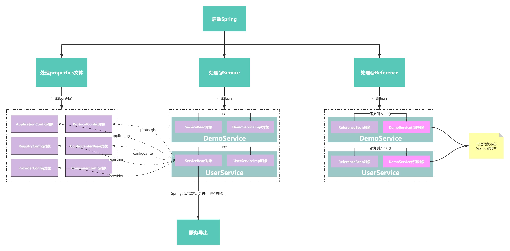
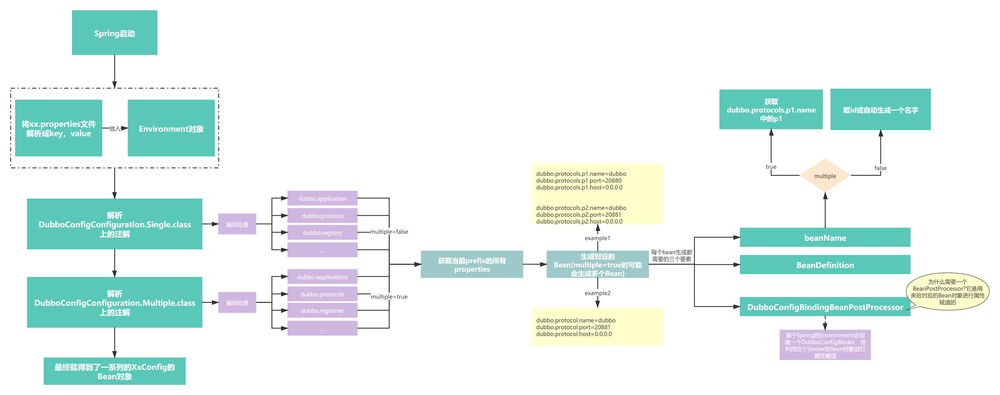
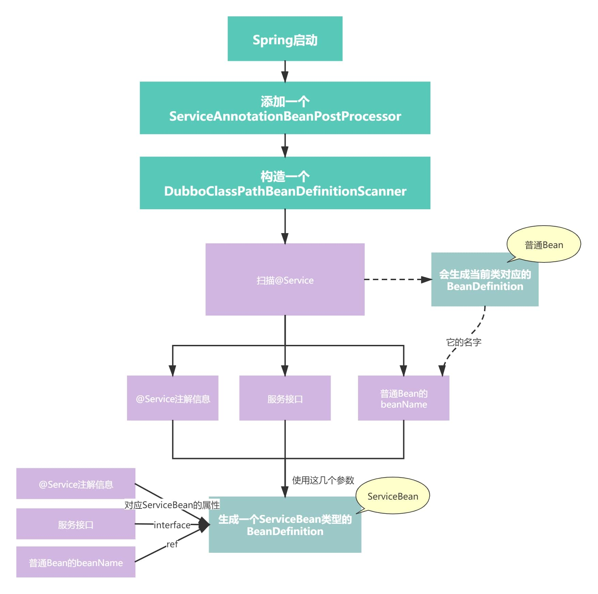
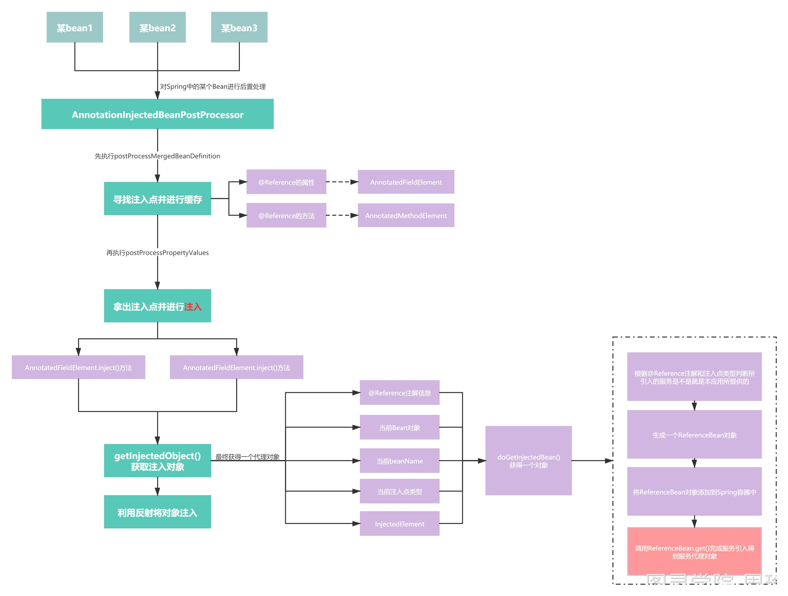

[TOC]

# 应用启动类与配置示例

应用配置类为ProviderConfiguration, 在配置上有两个比较重要的注解

1. @PropertySource表示将dubbo-provider.properties中的配置项添加到Spring容器中，可以通过@Value的方式获取到配置项中的值
2. @EnableDubbo(scanBasePackages = "org.apache.dubbo.demo.provider")表示对指定包下的类进行扫描，扫描@Service与@Reference注解，并且进行处理

```java
public class Application {
    public static void main(String[] args) throws Exception {
        AnnotationConfigApplicationContext context = new AnnotationConfigApplicationContext(ProviderConfiguration.class);
        context.start();
        System.in.read();
    }

    @Configuration
    @EnableDubbo(scanBasePackages = "org.apache.dubbo.demo.provider")
    @PropertySource("classpath:/spring/dubbo-provider.properties")
    static class ProviderConfiguration {
       
    }
}
```

# 整体流程图



# @EnableDubbo开启 dubbo 功能注解

在EnableDubbo注解上，有另外两个注解，也是研究Dubbo最重要的两个注解

1. @EnableDubboConfig
2. @DubboComponentScan

```java
@Target({ElementType.TYPE})
@Retention(RetentionPolicy.RUNTIME)
@Inherited
@Documented
@Import(DubboConfigConfigurationRegistrar.class)
public @interface EnableDubboConfig {
    boolean multiple() default true;
}
```

```java
@Target(ElementType.TYPE)
@Retention(RetentionPolicy.RUNTIME)
@Documented
@Import(DubboComponentScanRegistrar.class)
public @interface DubboComponentScan {
    String[] value() default {};

    String[] basePackages() default {};

    Class<?>[] basePackageClasses() default {};

}
```

注意两个注解中对应的@Import注解所导入的类：

1. DubboConfigConfigurationRegistrar
2. DubboComponentScanRegistrar

Spring在启动时会解析这两个注解，并且执行对应的Registrar类中的registerBeanDefinitions方法（这是Spring中提供的扩展功能。）

# DubboConfigConfigurationRegistrar解析配置并注册bean

DubboConfigConfigurationRegistrar的主要作用就是对propties文件进行解析并根据不同的配置项项生成对应类型的Bean对象

Spring启动时，会调用DubboConfigConfigurationRegistrar的registerBeanDefinitions方法，该方法是利用Spring中的AnnotatedBeanDefinitionReader来读取：

1. DubboConfigConfiguration.Single.**class**
2. DubboConfigConfiguration.Multiple.**class**

这两个类上的注解。

```java
public class DubboConfigConfigurationRegistrar implements ImportBeanDefinitionRegistrar {

    @Override
    public void registerBeanDefinitions(AnnotationMetadata importingClassMetadata, BeanDefinitionRegistry registry) {
        System.out.println("执行DubboConfigConfigurationRegistrar");


        AnnotationAttributes attributes = AnnotationAttributes.fromMap(
                importingClassMetadata.getAnnotationAttributes(EnableDubboConfig.class.getName()));

        boolean multiple = attributes.getBoolean("multiple"); //默认是true

        // Single Config Bindings
        registerBeans(registry, DubboConfigConfiguration.Single.class);

        // 默认为true
        if (multiple) { // Since 2.6.6 https://github.com/apache/dubbo/issues/3193
            registerBeans(registry, DubboConfigConfiguration.Multiple.class);
        }
    }
}
```

```java
public static void registerBeans(BeanDefinitionRegistry registry, Class<?>... annotatedClasses) {

    if (ObjectUtils.isEmpty(annotatedClasses)) {
        return;
    }

    // Remove all annotated-classes that have been registered
    Iterator<Class<?>> iterator = new ArrayList<>(asList(annotatedClasses)).iterator();

    while (iterator.hasNext()) {
        Class<?> annotatedClass = iterator.next();
        if (isPresentBean(registry, annotatedClass)) {
            iterator.remove();
        }
    }

    AnnotatedBeanDefinitionReader reader = new AnnotatedBeanDefinitionReader(registry);

    if (logger.isDebugEnabled()) {
        logger.debug(registry.getClass().getSimpleName() + " will register annotated classes : " + asList(annotatedClasses) + " .");
    }
    // 利用Spring中的AnnotatedBeanDefinitionReader来解析annotatedClasses
    // 会解析该类上的注解，然后进行处理
    reader.register(annotatedClasses);

}
```

对应的2个注解为：

```java
@EnableDubboConfigBindings({
  @EnableDubboConfigBinding(prefix = "dubbo.application", type = ApplicationConfig.class),
  @EnableDubboConfigBinding(prefix = "dubbo.module", type = ModuleConfig.class),
  @EnableDubboConfigBinding(prefix = "dubbo.registry", type = RegistryConfig.class),
  @EnableDubboConfigBinding(prefix = "dubbo.protocol", type = ProtocolConfig.class),
  @EnableDubboConfigBinding(prefix = "dubbo.monitor", type = MonitorConfig.class),
  @EnableDubboConfigBinding(prefix = "dubbo.provider", type = ProviderConfig.class),
  @EnableDubboConfigBinding(prefix = "dubbo.consumer", type = ConsumerConfig.class),
  @EnableDubboConfigBinding(prefix = "dubbo.config-center", type = ConfigCenterBean.class),
  @EnableDubboConfigBinding(prefix = "dubbo.metadata-report", type = MetadataReportConfig.class),
  @EnableDubboConfigBinding(prefix = "dubbo.metrics", type = MetricsConfig.class)
})
public static class Single {

}

@EnableDubboConfigBindings({
  @EnableDubboConfigBinding(prefix = "dubbo.applications", type = ApplicationConfig.class, multiple = true),
  @EnableDubboConfigBinding(prefix = "dubbo.modules", type = ModuleConfig.class, multiple = true),
  @EnableDubboConfigBinding(prefix = "dubbo.registries", type = RegistryConfig.class, multiple = true),
  @EnableDubboConfigBinding(prefix = "dubbo.protocols", type = ProtocolConfig.class, multiple = true),
  @EnableDubboConfigBinding(prefix = "dubbo.monitors", type = MonitorConfig.class, multiple = true),
  @EnableDubboConfigBinding(prefix = "dubbo.providers", type = ProviderConfig.class, multiple = true),
  @EnableDubboConfigBinding(prefix = "dubbo.consumers", type = ConsumerConfig.class, multiple = true),
  @EnableDubboConfigBinding(prefix = "dubbo.config-centers", type = ConfigCenterBean.class, multiple = true),
  @EnableDubboConfigBinding(prefix = "dubbo.metadata-reports", type = MetadataReportConfig.class, multiple = true),
  @EnableDubboConfigBinding(prefix = "dubbo.metricses", type = MetricsConfig.class, multiple = true)
})
public static class Multiple {

}
```

这两个类主要用到的就是@EnableDubboConfigBindings注解：

```java
@Target({ElementType.TYPE})
@Retention(RetentionPolicy.RUNTIME)
@Documented
@Import(DubboConfigBindingsRegistrar.class)
public @interface EnableDubboConfigBindings {

    /**
     * The value of {@link EnableDubboConfigBindings}
     *
     * @return non-null
     */
    EnableDubboConfigBinding[] value();

}
```

## DubboConfigBindingRegistrar解析前缀配置并注册对应Bean

此类中的主要方法是registerDubboConfigBeans()方法，主要功能就是获取用户所设置的properties文件中的内容，对Properties文件进行解析，根据Properties文件的每个配置项的前缀、参数名、参数值生成对应的BeanDefinition

```java
public class DubboConfigBindingsRegistrar implements ImportBeanDefinitionRegistrar, EnvironmentAware {

    private ConfigurableEnvironment environment;

    @Override
    public void registerBeanDefinitions(AnnotationMetadata importingClassMetadata, BeanDefinitionRegistry registry) {
        System.out.println("执行DubboConfigBindingsRegistrar");
        AnnotationAttributes attributes = AnnotationAttributes.fromMap(
                importingClassMetadata.getAnnotationAttributes(EnableDubboConfigBindings.class.getName()));

        // 拿到多个@EnableDubboConfigBinding注解
        AnnotationAttributes[] annotationAttributes = attributes.getAnnotationArray("value");

        DubboConfigBindingRegistrar registrar = new DubboConfigBindingRegistrar();
        registrar.setEnvironment(environment);

        for (AnnotationAttributes element : annotationAttributes) {

            // 逐个解析@EnableDubboConfigBinding注解，比如@EnableDubboConfigBinding(prefix = "dubbo.application", type = ApplicationConfig.class)
            registrar.registerBeanDefinitions(element, registry);

        }
    }

    @Override
    public void setEnvironment(Environment environment) {

        Assert.isInstanceOf(ConfigurableEnvironment.class, environment);

        this.environment = (ConfigurableEnvironment) environment;

    }

}
```

```java
protected void registerBeanDefinitions(AnnotationAttributes attributes, BeanDefinitionRegistry registry) {

        // prefix = "dubbo.application"
        String prefix = environment.resolvePlaceholders(attributes.getString("prefix"));

        // type = ApplicationConfig.class
        Class<? extends AbstractConfig> configClass = attributes.getClass("type");

        boolean multiple = attributes.getBoolean("multiple");

        registerDubboConfigBeans(prefix, configClass, multiple, registry);

    }

    private void registerDubboConfigBeans(String prefix,
                                          Class<? extends AbstractConfig> configClass,
                                          boolean multiple,
                                          BeanDefinitionRegistry registry) {

        // 从properties文件中根据前缀拿对应的配置项，比如根据dubbo.application前缀，
        // 就可以拿到：
        // dubbo.application.name=dubbo-demo-provider-application
        // dubbo.application.logger=log4j
        Map<String, Object> properties = getSubProperties(environment.getPropertySources(), prefix);

        // 如果没有相关的配置项，则不需要注册BeanDefinition
        if (CollectionUtils.isEmpty(properties)) {
            if (log.isDebugEnabled()) {
                log.debug("There is no property for binding to dubbo config class [" + configClass.getName()
                        + "] within prefix [" + prefix + "]");
            }
            return;
        }

        // 根据配置项生成beanNames，为什么会有多个？
        // 普通情况一个dubbo.application前缀对应一个ApplicationConfig类型的Bean
        // 特殊情况下，比如dubbo.protocols对应了：
//        dubbo.protocols.p1.name=dubbo
//        dubbo.protocols.p1.port=20880
//        dubbo.protocols.p1.host=0.0.0.0

//        dubbo.protocols.p2.name=http
//        dubbo.protocols.p2.port=8082
//        dubbo.protocols.p2.host=0.0.0.0
        // 那么就需要对应两个ProtocolConfig类型的Bean，那么就需要两个beanName:p1和p2

        // 这里就是multiple为true或false的区别，名字的区别，根据multiple用来判断是否从配置项中获取beanName
        // 如果multiple为false，则看有没有配置id属性，如果没有配置则自动生成一个beanName.
        Set<String> beanNames = multiple ? resolveMultipleBeanNames(properties) :
                Collections.singleton(resolveSingleBeanName(properties, configClass, registry));

        for (String beanName : beanNames) {

            // 为每个beanName,注册一个空的BeanDefinition
            registerDubboConfigBean(beanName, configClass, registry);

            // 为每个bean注册一个DubboConfigBindingBeanPostProcessor的Bean后置处理器
            registerDubboConfigBindingBeanPostProcessor(prefix, beanName, multiple, registry);

        }

        // 注册一个NamePropertyDefaultValueDubboConfigBeanCustomizer的bean
        // 用来把某个XxConfig所对应的beanName设置到name属性中去
        registerDubboConfigBeanCustomizers(registry);

    }
```

## 注册DubboConfigBindingBeanPostProcessor后置处理器设置属性

DubboConfigBindingBeanPostProcessor是一个BeanPostProcessor，在Spring启动过程中，会针对所有的Bean对象进行后置加工，但是在DubboConfigBindingBeanPostProcessor中有如下判断

```java
private void registerDubboConfigBindingBeanPostProcessor(String prefix, String beanName, boolean multiple,
                                                         BeanDefinitionRegistry registry) {

    // 注册一个DubboConfigBindingBeanPostProcessor的Bean
    // 每个XxConfig的Bean对应一个DubboConfigBindingBeanPostProcessor的Bean
    // 比如，一个ApplicationConfig对应一个DubboConfigBindingBeanPostProcessor，
    // 一个ProtocolConfig也会对应一个DubboConfigBindingBeanPostProcessor
    // 在构造DubboConfigBindingBeanPostProcessor的时候会指定构造方法的值，这样就可以区别开来了

    Class<?> processorClass = DubboConfigBindingBeanPostProcessor.class;

    BeanDefinitionBuilder builder = rootBeanDefinition(processorClass);

    // 真实的前缀，比如dubbo.registries.r2
    String actualPrefix = multiple ? normalizePrefix(prefix) + beanName : prefix;

    // 添加两个构造方法参数值，所以会调用DubboConfigBindingBeanPostProcessor的两个参数的构造方法
    builder.addConstructorArgValue(actualPrefix).addConstructorArgValue(beanName);

    AbstractBeanDefinition beanDefinition = builder.getBeanDefinition();

    beanDefinition.setRole(BeanDefinition.ROLE_INFRASTRUCTURE);

    registerWithGeneratedName(beanDefinition, registry);

    if (log.isInfoEnabled()) {
        log.info("The BeanPostProcessor bean definition [" + processorClass.getName()
                + "] for dubbo config bean [name : " + beanName + "] has been registered.");
    }

}
```

后置处理器的回调实现：

```java
@Override
public Object postProcessBeforeInitialization(Object bean, String beanName) throws BeansException {

    // 每个XxConfig对应一个BeanPostProcessor，所以每个DubboConfigBindingBeanPostProcessor只处理对应的beanName

    if (this.beanName.equals(beanName) && bean instanceof AbstractConfig) {

        AbstractConfig dubboConfig = (AbstractConfig) bean;
        // 从properties文件中获取值，并设置到dubboConfig对象中
        bind(prefix, dubboConfig);

        // 设置dubboConfig对象的name属性，设置为beanName
        customize(beanName, dubboConfig);

    }

    return bean;

}
```

所以DubboConfigBindingBeanPostProcessor并不会处理Spring容器中的所有Bean，它只会处理上文由Dubbo所生成的Bean对象

并且，在afterPropertiesSet()方法中，会先创建一个DefaultDubboConfigBinder

```java
public class DefaultDubboConfigBinder extends AbstractDubboConfigBinder {

    @Override
    public <C extends AbstractConfig> void bind(String prefix, C dubboConfig) {
        DataBinder dataBinder = new DataBinder(dubboConfig);
        // Set ignored*
        dataBinder.setIgnoreInvalidFields(isIgnoreInvalidFields());
        dataBinder.setIgnoreUnknownFields(isIgnoreUnknownFields());
        // Get properties under specified prefix from PropertySources
        // getPropertySources()会拿到由@PropertySource注入进来的properties文件中的内容
        // 同时还包括当前java的所有环境变量，包括手动通过-D添加的配置

        Map<String, Object> properties = getSubProperties(getPropertySources(), prefix);
        // Convert Map to MutablePropertyValues
        MutablePropertyValues propertyValues = new MutablePropertyValues(properties);
        // Bind
        dataBinder.bind(propertyValues);
    }

}
```

当某个AbstractConfig类型的Bean，在经过DubboConfigBindingBeanPostProcessor处理时，此时Bean对象中的属性是没有值的，会利用DefaultDubboConfigBinder进行赋值。底层就是利用Spring中的DataBinder技术，结合properties文件对对应的属性进行赋值。

对应一个AbstractConfig类型（针对的其实是子类，比如ApplicationConfig、RegistryConfig）的Bean，每个类都有一些属性，而properties文件是一个key-value对，所以实际上DataBinder就是将属性名和properties文件中的key进行匹配，如果匹配成功，则把value赋值给属性

## 属性解析流程图



# DubboComponentScanRegistrar扫描dubbo 服务组件

DubboConfigConfigurationRegistrar的作用是向Spring容器中注册两个Bean:

1. ServiceAnnotationBeanPostProcessor
2. ReferenceAnnotationBeanPostProcessor

## ServiceAnnotationBeanPostProcessor扫描@Service 并注册

ServiceAnnotationBeanPostProcessor是一个BeanDefinitionRegistryPostProcessor，是用来注册BeanDefinition的，注意是**BeanFactoryPostProcessor**类型。

它的主要作用是扫描Dubbo的@Service注解，一旦扫描到某个@Service注解就把它以及被它注解的类当做一个Dubbo服务，进行**服务导出**

```java
@Override
public void registerBeanDefinitions(AnnotationMetadata importingClassMetadata, BeanDefinitionRegistry registry) {
    System.out.println("执行DubboComponentScanRegistrar");

    // 拿到DubboComponentScan注解所定义的包路径，扫描该package下的类，识别这些类上
    Set<String> packagesToScan = getPackagesToScan(importingClassMetadata);

    // 注册ServiceAnnotationBeanPostProcessor
    // 实现了BeanDefinitionRegistryPostProcessor接口，所以在Spring启动时会调用postProcessBeanDefinitionRegistry方法
    // 该方法会进行扫描，扫描@Service注解了的类，然后生成BeanDefinition（会生成两个，一个普通的bean，一个ServiceBean），后续的Spring周期中会生成Bean
    // 在ServiceBean中会监听ContextRefreshedEvent事件，一旦Spring启动完后，就会进行服务导出
    registerServiceAnnotationBeanPostProcessor(packagesToScan, registry);

    // 注册ReferenceAnnotationBeanPostProcessor
    // 实现了AnnotationInjectedBeanPostProcessor接口，继而实现了InstantiationAwareBeanPostProcessorAdapter接口
    // 所以Spring在启动时，在对属性进行注入时会调用AnnotationInjectedBeanPostProcessor接口中的postProcessPropertyValues方法
    // 在这个过程中会按照@Reference注解的信息去生成一个RefrenceBean对象
    registerReferenceAnnotationBeanPostProcessor(registry);

}
```

```java
private void registerServiceAnnotationBeanPostProcessor(Set<String> packagesToScan, BeanDefinitionRegistry registry) {
    // 生成一个RootBeanDefinition，对应的beanClass为ServiceAnnotationBeanPostProcessor.class
    BeanDefinitionBuilder builder = rootBeanDefinition(ServiceAnnotationBeanPostProcessor.class);
    // 将包路径作为在构造ServiceAnnotationBeanPostProcessor时调用构造方法时的传入参数
    builder.addConstructorArgValue(packagesToScan);
    builder.setRole(BeanDefinition.ROLE_INFRASTRUCTURE);
    AbstractBeanDefinition beanDefinition = builder.getBeanDefinition();
    BeanDefinitionReaderUtils.registerWithGeneratedName(beanDefinition, registry);

}
```

在启动 Spring 容器的时候，会回调 BeanFactoryPostProcessor 方法，用来扫描带有@Service 注解的类

```java
@Override
public void postProcessBeanDefinitionRegistry(BeanDefinitionRegistry registry) throws BeansException {

    Set<String> resolvedPackagesToScan = resolvePackagesToScan(packagesToScan);

    if (!CollectionUtils.isEmpty(resolvedPackagesToScan)) {
        // 扫描包，进行Bean注册
        registerServiceBeans(resolvedPackagesToScan, registry);
    } else {
        if (logger.isWarnEnabled()) {
            logger.warn("packagesToScan is empty , ServiceBean registry will be ignored!");
        }
    }

}
```

DubboClassPathBeanDefinitionScanner是所Dubbo自定义的扫描器，继承了Spring中的ClassPathBeanDefinitionScanner了。

DubboClassPathBeanDefinitionScanner相对于ClassPathBeanDefinitionScanner并没有做太多的改变，只是把useDefaultFilters设置为了false，主要是因为Dubbo中的@Service注解是Dubbo自定义的，在这个注解上并没有用@Component注解（因为Dubbo不是一定要结合Spring才能用），所以为了能利用Spring的扫描逻辑，需要把useDefaultFilters设置为false。

```java
private void registerServiceBeans(Set<String> packagesToScan, BeanDefinitionRegistry registry) {

    //自定义的扫描器
    DubboClassPathBeanDefinitionScanner scanner =
            new DubboClassPathBeanDefinitionScanner(registry, environment, resourceLoader);

    //beanName 生成策略
    BeanNameGenerator beanNameGenerator = resolveBeanNameGenerator(registry);

    scanner.setBeanNameGenerator(beanNameGenerator);

    // 扫描被Service注解标注的类
    scanner.addIncludeFilter(new AnnotationTypeFilter(Service.class));

    /**
     * Add the compatibility for legacy Dubbo's @Service
     *
     * The issue : https://github.com/apache/dubbo/issues/4330
     * @since 2.7.3
     */
    scanner.addIncludeFilter(new AnnotationTypeFilter(com.alibaba.dubbo.config.annotation.Service.class));

    for (String packageToScan : packagesToScan) {

        // Registers @Service Bean first
        // 扫描Dubbo自定义的@Service注解
        scanner.scan(packageToScan);

        // 查找被@Service注解的类的BeanDefinition（无论这个类有没有被@ComponentScan注解标注了）
        // Finds all BeanDefinitionHolders of @Service whether @ComponentScan scans or not.
        Set<BeanDefinitionHolder> beanDefinitionHolders =
                findServiceBeanDefinitionHolders(scanner, packageToScan, registry, beanNameGenerator);

        if (!CollectionUtils.isEmpty(beanDefinitionHolders)) {

            // 扫描到BeanDefinition开始处理它
            for (BeanDefinitionHolder beanDefinitionHolder : beanDefinitionHolders) {
                registerServiceBean(beanDefinitionHolder, registry, scanner);
            }

            if (logger.isInfoEnabled()) {
                logger.info(beanDefinitionHolders.size() + " annotated Dubbo's @Service Components { " +
                        beanDefinitionHolders +
                        " } were scanned under package[" + packageToScan + "]");
            }

        } else {

            if (logger.isWarnEnabled()) {
                logger.warn("No Spring Bean annotating Dubbo's @Service was found under package["
                        + packageToScan + "]");
            }

        }

    }

}
```

## 注册ServiceBean类型 bean

每扫描到一个@Service注解，就会得到一个BeanDefinition，这个BeanDefinition的beanClass属性就是具体的服务实现类。并且，还需要解析@Service注解的配置信息，因为这些都是服务的参数信息，所以在扫描完了之后，会针对所得到的每个BeanDefinition，都会**额外**的再生成一个**ServiceBean**类型的Bean对象

**所以在扫描到一个@Service注解后，其实会得到两个Bean:**

1. 一个就是服务实现类本身一个Bean对象
2. 一个就是对应的ServiceBean类型的一个Bean对象

```java
private void registerServiceBean(BeanDefinitionHolder beanDefinitionHolder, BeanDefinitionRegistry registry,
                                 DubboClassPathBeanDefinitionScanner scanner) {
    // 服务实现类
    Class<?> beanClass = resolveClass(beanDefinitionHolder);
    // @Service注解
    Annotation service = findServiceAnnotation(beanClass);

    /**
     * The {@link AnnotationAttributes} of @Service annotation
     */
    // 获取@Service注解上的信息
    AnnotationAttributes serviceAnnotationAttributes = getAnnotationAttributes(service, false, false);

    // 服务实现类对应的接口
    Class<?> interfaceClass = resolveServiceInterfaceClass(serviceAnnotationAttributes, beanClass);
    // 服务实现类对应的bean的名字，比如：demoServiceImpl
    String annotatedServiceBeanName = beanDefinitionHolder.getBeanName();

    // 生成一个ServiceBean
    AbstractBeanDefinition serviceBeanDefinition =
            buildServiceBeanDefinition(service, serviceAnnotationAttributes, interfaceClass, annotatedServiceBeanName);

    // ServiceBean Bean name
    String beanName = generateServiceBeanName(serviceAnnotationAttributes, interfaceClass);

    if (scanner.checkCandidate(beanName, serviceBeanDefinition)) { // check duplicated candidate bean

        // 把ServiceBean注册进去，对应的beanName为ServiceBean:org.apache.dubbo.demo.DemoService
        registry.registerBeanDefinition(beanName, serviceBeanDefinition);

        if (logger.isInfoEnabled()) {
            logger.info("The BeanDefinition[" + serviceBeanDefinition +
                    "] of ServiceBean has been registered with name : " + beanName);
        }

    } else {

        if (logger.isWarnEnabled()) {
            logger.warn("The Duplicated BeanDefinition[" + serviceBeanDefinition +
                    "] of ServiceBean[ bean name : " + beanName +
                    "] was be found , Did @DubboComponentScan scan to same package in many times?");
        }

    }

}
```

ServiceBean表示一个Dubbo服务，它有一些参数，比如：

1. **ref，表示服务的具体实现类**
2. **interface，表示服务的接口**
3. **parameters，表示服务的参数（@Service注解中所配置的信息）**
4. **application，表示服务所属的应用**
5. **protocols，表示服务所使用的协议**
6. **registries，表示服务所要注册的注册中心**

```java
private AbstractBeanDefinition buildServiceBeanDefinition(Annotation serviceAnnotation,
                                                          AnnotationAttributes serviceAnnotationAttributes,
                                                          Class<?> interfaceClass,
                                                          String annotatedServiceBeanName) {
    // 生成一个ServiceBean对应的BeanDefinition
    BeanDefinitionBuilder builder = rootBeanDefinition(ServiceBean.class);

    AbstractBeanDefinition beanDefinition = builder.getBeanDefinition();

    MutablePropertyValues propertyValues = beanDefinition.getPropertyValues();

    String[] ignoreAttributeNames = of("provider", "monitor", "application", "module", "registry", "protocol",
            "interface", "interfaceName", "parameters");

    // 把serviceAnnotation中的参数值赋值给ServiceBean的属性
    propertyValues.addPropertyValues(new AnnotationPropertyValuesAdapter(serviceAnnotation, environment, ignoreAttributeNames));

    // References "ref" property to annotated-@Service Bean
    // ref属性赋值为另外一个bean, 对应的就是被@Service注解的服务实现类对应的bean
    addPropertyReference(builder, "ref", annotatedServiceBeanName);
    // Set interface
    builder.addPropertyValue("interface", interfaceClass.getName());
    // Convert parameters into map
    builder.addPropertyValue("parameters", convertParameters(serviceAnnotationAttributes.getStringArray("parameters")));

    // 配置了methods属性，则给ServiceBean对应的methods属性赋值
    // Add methods parameters
    List<MethodConfig> methodConfigs = convertMethodConfigs(serviceAnnotationAttributes.get("methods"));
    if (!methodConfigs.isEmpty()) {
        builder.addPropertyValue("methods", methodConfigs);
    }

    /**
     * Add {@link org.apache.dubbo.config.ProviderConfig} Bean reference
     */
    String providerConfigBeanName = serviceAnnotationAttributes.getString("provider");
    if (StringUtils.hasText(providerConfigBeanName)) {
        addPropertyReference(builder, "provider", providerConfigBeanName);
    }

    /**
     * Add {@link org.apache.dubbo.config.MonitorConfig} Bean reference
     */
    String monitorConfigBeanName = serviceAnnotationAttributes.getString("monitor");
    if (StringUtils.hasText(monitorConfigBeanName)) {
        addPropertyReference(builder, "monitor", monitorConfigBeanName);
    }

    /**
     * Add {@link org.apache.dubbo.config.ApplicationConfig} Bean reference
     */
    String applicationConfigBeanName = serviceAnnotationAttributes.getString("application");
    if (StringUtils.hasText(applicationConfigBeanName)) {
        addPropertyReference(builder, "application", applicationConfigBeanName);
    }

    /**
     * Add {@link org.apache.dubbo.config.ModuleConfig} Bean reference
     */
    String moduleConfigBeanName = serviceAnnotationAttributes.getString("module");
    if (StringUtils.hasText(moduleConfigBeanName)) {
        addPropertyReference(builder, "module", moduleConfigBeanName);
    }


    /**
     * Add {@link org.apache.dubbo.config.RegistryConfig} Bean reference
     * 获取注解上配置的注册中心的beanName
     */
    String[] registryConfigBeanNames = serviceAnnotationAttributes.getStringArray("registry");

    List<RuntimeBeanReference> registryRuntimeBeanReferences = toRuntimeBeanReferences(registryConfigBeanNames);

    if (!registryRuntimeBeanReferences.isEmpty()) {
        builder.addPropertyValue("registries", registryRuntimeBeanReferences);
    }

    /**
     * Add {@link org.apache.dubbo.config.ProtocolConfig} Bean reference
     */
    String[] protocolConfigBeanNames = serviceAnnotationAttributes.getStringArray("protocol");

    List<RuntimeBeanReference> protocolRuntimeBeanReferences = toRuntimeBeanReferences(protocolConfigBeanNames);

    if (!protocolRuntimeBeanReferences.isEmpty()) {
        builder.addPropertyValue("protocols", protocolRuntimeBeanReferences);
    }

    return builder.getBeanDefinition();

}
```

并且需要注意的是，ServiceBean实现了ApplicationListener接口，所以当Spring启动完成后会触发onApplicationEvent()方法的调用，而在这个方法内会调用**export()**，这个方法就是**服务导出的入口方法**

## @Service处理流程图



# ReferenceAnnotationBeanPostProcessor扫描@Reference 并注册

ReferenceAnnotationBeanPostProcessor是处理@Reference注解的。父类是AnnotationInjectedBeanPostProcessor，是一个InstantiationAwareBeanPostProcessorAdapter，是一个BeanPostProcessor。

Spring在对Bean进行依赖注入时会调用AnnotationInjectedBeanPostProcessor的postProcessPropertyValues()方法来给某个Bean按照ReferenceAnnotationBeanPostProcessor的逻辑进行依赖注入（同AutowiredAnnotationBeanPostProcessor功能类似）

```java
@Override
public PropertyValues postProcessPropertyValues(
        PropertyValues pvs, PropertyDescriptor[] pds, Object bean, String beanName) throws BeanCreationException {

    // 寻找需要注入的属性
    // @Reference注解的属性或方法都是注入点
    InjectionMetadata metadata = findInjectionMetadata(beanName, bean.getClass(), pvs);
    try {
        // 调用AnnotatedFieldElement、AnnotatedMethodElement的 inject 方法进行反射注入
        metadata.inject(bean, beanName, pvs);
    } catch (BeanCreationException ex) {
        throw ex;
    } catch (Throwable ex) {
        throw new BeanCreationException(beanName, "Injection of @" + getAnnotationType().getSimpleName()
                + " dependencies is failed", ex);
    }
    return pvs;
}
```

## 查找 bean 上的注入点

针对某个Bean找到所有注入点之后，就会进行注入了，注入就是给属性或给set方法赋值，但是在赋值之前得先得到一个值，此时就会调用ReferenceAnnotationBeanPostProcessor的**doGetInjectedBean()**方法来得到一个对象，而这个对象的构造就比较复杂了，因为对于Dubbo来说，注入给某个属性的应该是当前这个**属性所对应的服务接口的代理对象**

```java
private AnnotationInjectedBeanPostProcessor.AnnotatedInjectionMetadata buildAnnotatedMetadata(final Class<?> beanClass) {

    // 哪些Filed上有@Reference注解
    Collection<AnnotationInjectedBeanPostProcessor.AnnotatedFieldElement> fieldElements = findFieldAnnotationMetadata(beanClass);
    // 哪些方法上有@Reference注解
    Collection<AnnotationInjectedBeanPostProcessor.AnnotatedMethodElement> methodElements = findAnnotatedMethodMetadata(beanClass);
    // 返回的是Dubbo定义的AnnotatedInjectionMetadata，接下来就会使用这个类去进行属性注入
    return new AnnotationInjectedBeanPostProcessor.AnnotatedInjectionMetadata(beanClass, fieldElements, methodElements);

}

private InjectionMetadata findInjectionMetadata(String beanName, Class<?> clazz, PropertyValues pvs) {
    // Fall back to class name as cache key, for backwards compatibility with custom callers.
    String cacheKey = (StringUtils.hasLength(beanName) ? beanName : clazz.getName());
    // Quick check on the concurrent map first, with minimal locking.
    AnnotationInjectedBeanPostProcessor.AnnotatedInjectionMetadata metadata = this.injectionMetadataCache.get(cacheKey);
    if (InjectionMetadata.needsRefresh(metadata, clazz)) {
        synchronized (this.injectionMetadataCache) {
            metadata = this.injectionMetadataCache.get(cacheKey);
            if (InjectionMetadata.needsRefresh(metadata, clazz)) {
                if (metadata != null) {
                    metadata.clear(pvs);
                }
                try {
                    metadata = buildAnnotatedMetadata(clazz);
                    this.injectionMetadataCache.put(cacheKey, metadata);
                } catch (NoClassDefFoundError err) {
                    throw new IllegalStateException("Failed to introspect object class [" + clazz.getName() +
                            "] for annotation metadata: could not find class that it depends on", err);
                }
            }
        }
    }
    return metadata;
}
```

## 属性或方法注入实现方式

属性字段的注入实现：

```java
public class AnnotatedFieldElement extends InjectionMetadata.InjectedElement {

    private final Field field;

    private final AnnotationAttributes attributes;

    private volatile Object bean;

    protected AnnotatedFieldElement(Field field, AnnotationAttributes attributes) {
        super(field, null);
        this.field = field;
        this.attributes = attributes;
    }

    @Override
    protected void inject(Object bean, String beanName, PropertyValues pvs) throws Throwable {
        // 给bean对象进行属性赋值

        Class<?> injectedType = field.getType();

        // 获取对象，然后进行注入
        Object injectedObject = getInjectedObject(attributes, bean, beanName, injectedType, this);

        ReflectionUtils.makeAccessible(field);

        // 字段赋值，injectedObject就是值
        field.set(bean, injectedObject);

    }

}
```

方法的注入实现：

```java
private class AnnotatedMethodElement extends InjectionMetadata.InjectedElement {

    private final Method method;

    private final AnnotationAttributes attributes;

    private volatile Object object;

    protected AnnotatedMethodElement(Method method, PropertyDescriptor pd, AnnotationAttributes attributes) {
        super(method, pd);
        this.method = method;
        this.attributes = attributes;
    }

    @Override
    protected void inject(Object bean, String beanName, PropertyValues pvs) throws Throwable {

        // set方法对应的属性的类型
        Class<?> injectedType = pd.getPropertyType();

        // 从Spring容器中获取一个Bean（注意，这个方法内部会生成Bean而且会缓存，就像Spring中的getBean一样）
        Object injectedObject = getInjectedObject(attributes, bean, beanName, injectedType, this);

        ReflectionUtils.makeAccessible(method);

        // 调用set方法
        method.invoke(bean, injectedObject);

    }

}
```

## 生成代理对象前的思考

但是在生成这个代理对象之前，还要考虑问题：

1. 当前所需要引入的这个服务，是不是在本地就存在？不存在则要把按Dubbo的逻辑生成一个代理对象
2. 当前所需要引入的这个服务，是不是已经被引入过了（是不是已经生成过代理对象了），如果是应该是不用再重复去生成了

**首先如何判断当前所引入的服务是本地的一个服务（就是当前应用自己所提供的服务）。**

我们前面提到，Dubbo通过@Service来提供一个服务，并且会生成两个Bean：

1. 一个服务实现类本身Bean
2. 一个ServiceBean类型的Bean，这个Bean的名字是这么生成的：

```java
private String generateServiceBeanName(AnnotationAttributes serviceAnnotationAttributes, Class<?> interfaceClass) {
	ServiceBeanNameBuilder builder = create(interfaceClass, environment)
                .group(serviceAnnotationAttributes.getString("group"))
                .version(serviceAnnotationAttributes.getString("version"));
	return builder.build();
}
```

是通过接口类型+group+version来作为ServiceBean类型Bean的名字的。

所以现在对于服务引入，也应该提前根据@Reference注解中的信息和属性接口类型去判断一下当前Spring容器中是否存在对应的ServiceBean对象，如果存在则直接取出ServiceBean对象的ref属性所对应的对象，作为要注入的结果。

**然后如何判断当前所引入的这个服务是否已经被引入过了（是不是已经生成过代理对象了）。**

这就需要在第一次引入某个服务后（生成代理对象后）进行缓存（记录一下）。Dubbo中是这么做的:

1. 首先根据@Reference注解的所有信息+属性接口类型生成一个**字符串**
2. 然后@Reference注解的所有信息+属性接口类型生成一个ReferenceBean对象（**ReferenceBean对象中的get方法可以得到一个Dubbo生成的代理对象，可以理解为服务引入的入口方法**）
3. 把字符串作为beanName，ReferenceBean对象作为bean注册到Spring容器中，同时也会放入**referenceBeanCache**中

## 创建注入的代理对象

```java
protected Object getInjectedObject(AnnotationAttributes attributes, Object bean, String beanName, Class<?> injectedType,
                                   InjectionMetadata.InjectedElement injectedElement) throws Exception {
    // ServiceBean:org.apache.dubbo.demo.DemoService#source=private org.apache.dubbo.demo.DemoService org.apache.dubbo.demo.consumer.comp.DemoServiceComponent.demoService#attributes={parameters=[Ljava.lang.String;@42e25b0b}
    // 缓存 key
    String cacheKey = buildInjectedObjectCacheKey(attributes, bean, beanName, injectedType, injectedElement);
    // cacheKey很鸡肋，属性名不一样的时候，cacheKey不一样，导致不能缓存， 在一个Service中@Reference两次同一个服务无法通过缓存查询到

    Object injectedObject = injectedObjectsCache.get(cacheKey);

    if (injectedObject == null) {
        //创建注入之后的对象
        injectedObject = doGetInjectedBean(attributes, bean, beanName, injectedType, injectedElement);

        // Customized inject-object if necessary
        injectedObjectsCache.putIfAbsent(cacheKey, injectedObject);
    }

    return injectedObject;

}
```

```java
// 返回的对象会注入给@ReferenceBean注解的属性
@Override
protected Object doGetInjectedBean(AnnotationAttributes attributes, Object bean, String beanName, Class<?> injectedType,
                                   InjectionMetadata.InjectedElement injectedElement) throws Exception {

    /**
     * The name of bean that annotated Dubbo's {@link Service @Service} in local Spring {@link ApplicationContext}
     */
    // 按ServiceBean的beanName生成规则来生成referencedBeanName， 规则为ServiceBean:interfaceClassName:version:group
    String referencedBeanName = buildReferencedBeanName(attributes, injectedType);

    /**
     * The name of bean that is declared by {@link Reference @Reference} annotation injection
     */
    // @Reference(methods=[Lorg.apache.dubbo.config.annotation.Method;@39b43d60) org.apache.dubbo.demo.DemoService
    // 根据@Reference注解的信息生成referenceBeanName
    String referenceBeanName = getReferenceBeanName(attributes, injectedType);

    // 如果不存在则创建ReferenceBean对象
    ReferenceBean referenceBean = buildReferenceBeanIfAbsent(referenceBeanName, attributes, injectedType);

    // 把referenceBean添加到Spring容器中去
    registerReferenceBean(referencedBeanName, referenceBean, attributes, injectedType);

    // 保存到缓存中
    cacheInjectedReferenceBean(referenceBean, injectedElement);

    // 创建一个代理对象，Service中的属性被注入的就是这个代理对象
    return getOrCreateProxy(referencedBeanName, referenceBeanName, referenceBean, injectedType);
}
```

1. 得到当前所引入服务对应的ServiceBean的beanName（源码中叫referencedBeanName）
2. 根据@Reference注解的所有信息+属性接口类型得到一个referenceBeanName
3. 根据referenceBeanName从**referenceBeanCach**e获取对应的ReferenceBean，如果没有则创建一个ReferenceBean
4. 根据referencedBeanName（ServiceBean的beanName）判断Spring容器中是否存在该bean，如果存在则给ref属性所对应的bean取一个别名，别名为referenceBeanName。

5. 如果Spring容器中不存在referencedBeanName对应的bean，则判断容器中是否存在referenceBeanName所对应的Bean，如果不存在则将创建出来的ReferenceBean注册到Spring容器中（此处这么做就支持了可以通过@Autowired注解也可以使用服务了，ReferenceBean是一个FactoryBean）

1. 如果referencedBeanName存在对应的Bean，则额外生成一个代理对象，代理对象的InvocationHandler会缓存在localReferenceBeanInvocationHandlerCache中，这样如果引入的是同一个服务，并且这个服务在本地
2. 如果referencedBeanName不存在对应的Bean，则直接调用ReferenceBean的get()方法得到一个代理对象

## @Reference处理流程图




