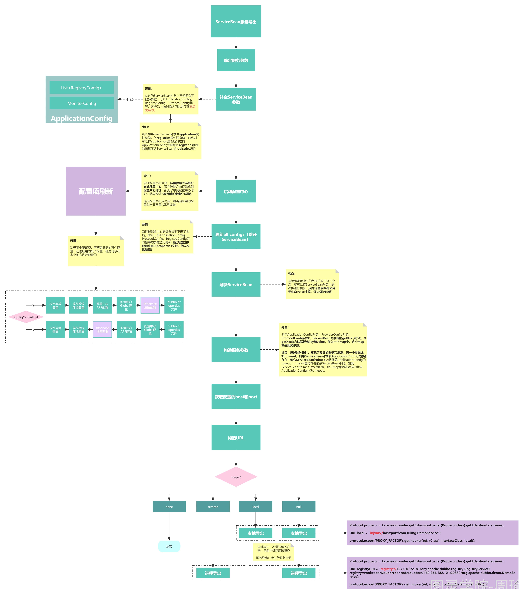

[TOC]

# 服务导出源码流程

服务导出的入口为ServiceBean中的export()方法，当Spring启动完之后，通过接收Spring的ContextRefreshedEvent事件来触发export()方法的执行。

一个ServiceBean对象就表示一个Dubbo服务，ServiceBean对象中的参数就表示服务的参数，比如timeout，该对象的参数值来至@Service注解中所定义的。

服务导出主要得做两件事情：

1. 根据服务的参数信息，启动对应的网络服务器（netty、tomcat、jetty等），用来接收网络请求
2. 将服务的信息注册到注册中心

但是在做这两件事情之前得先把服务的参数确定好，因为一个Dubbo服务的参数，除开可以在@Service注解中去配置，还会继承Dubbo服务所属应用（Application）上的配置，还可以在配置中心或JVM环境变量中去配置某个服务的参数，所以首先要做的是确定好当前服务最终的（优先级最高）的参数值。

确定好服务参数之后，就根据所配置的协议启动对应的网络服务器。在启动网络服务器时，并且在网络服务器接收请求的过程中，都可以从服务参数中获取信息，比如最大连接数，线程数，socket超时时间等等。

启动完网络服务器之后，就将服务信息注册到注册中心。同时还有向注册中心注册监听器，监听Dubbo的中的动态配置信息变更

服务导出要做的几件事情：

1. 确定服务的参数
2. 确定服务支持的协议
3. 构造服务最终的URL
4. 将服务URL注册到注册中心去
5. 根据服务支持的不同协议，启动不同的Server，用来接收和处理请求
6. 因为Dubbo支持动态配置服务参数，所以服务导出时还需要绑定一个监听器Listener来监听服务的参数是否有修改，如果发现有修改，则需要重新进行导出

# ServiceBean导出入口

ServiceBean.export()方法是导出的入口方法，会执行ServiceConfig.export()方法完成服务导出，导出完了之后会发布一个Spring事件ServiceBeanExportedEvent

```java
@Override
public void export() {
    super.export();
    // Publish ServiceBeanExportedEvent
    // Spring启动完发布ContextRefreshedEvent事件--->服务导出--->发布ServiceBeanExportedEvent
    // 程序员可以通过Spring中的ApplicationListener来监听服务导出是否完成
    publishExportEvent();
}

private void publishExportEvent() {
    ServiceBeanExportedEvent exportEvent = new ServiceBeanExportedEvent(this);
    applicationEventPublisher.publishEvent(exportEvent);
}
```

```java
public synchronized void export() {
    checkAndUpdateSubConfigs();

    // 检查服务是否需要导出
    if (!shouldExport()) {
        return;
    }

    // 参数刷新和检查完成了之后，就会开始导出服务，如果配置了延迟导出，那么则按指定的时间利用ScheduledExecutorService来进行延迟导出
    if (shouldDelay()) {
        DELAY_EXPORT_EXECUTOR.schedule(this::doExport, getDelay(), TimeUnit.MILLISECONDS);
    } else {
        // 导出服务
        doExport();
    }
}
```

# 确定服务参数

方法主要完成AbstractConfig的参数刷新(从配置中心获取参数等等)，AbstractConfig是指ApplicationConfig、ProtocolConfig、ServiceConfig等等，刷新完后会检查stub、local、mock等参数是否配置正确

```java
public void checkAndUpdateSubConfigs() {
    // Use default configs defined explicitly on global configs
    // ServiceConfig中的某些属性如果是空的，那么就从ProviderConfig、ModuleConfig、ApplicationConfig中获取
    completeCompoundConfigs();

    // Config Center should always being started first.
    // 包括针对应用和全局的配置
    // 从配置中心获取配置，把获取到的配置放入到Environment中的externalConfigurationMap（全局配置）和appExternalConfigurationMap中（应用配置）
    // 并刷新所有的XxConfig的属性（除开ServiceConfig），刷新的意思就是将配置中心的配置覆盖调内存中XxConfig中的属性
    startConfigCenter();

    checkDefault();

    checkProtocol();

    checkApplication();

    // if protocol is not injvm checkRegistry
    // 如果protocol不是只有injvm协议，表示服务调用不是只在本机jvm里面调用，那就需要用到注册中心
    if (!isOnlyInJvm()) {
        checkRegistry();
    }

    // 刷新ServiceConfig
    this.refresh();

    // 如果配了metadataReportConfig，那么就刷新配置
    checkMetadataReport();

    if (StringUtils.isEmpty(interfaceName)) {
        throw new IllegalStateException("<dubbo:service interface=\"\" /> interface not allow null!");
    }

    // 当前服务对应的实现类是一个GenericService，表示没有特定的接口
    if (ref instanceof GenericService) {
        interfaceClass = GenericService.class;
        if (StringUtils.isEmpty(generic)) {
            generic = Boolean.TRUE.toString();
        }
    } else {
        // 加载接口
        try {
            interfaceClass = Class.forName(interfaceName, true, Thread.currentThread()
                    .getContextClassLoader());
        } catch (ClassNotFoundException e) {
            throw new IllegalStateException(e.getMessage(), e);
        }
        // 刷新MethodConfig，并判断MethodConfig中对应的方法在接口中是否存在
        checkInterfaceAndMethods(interfaceClass, methods);
        // 实现类是不是该接口类型
        checkRef();
        generic = Boolean.FALSE.toString();
    }
    // local和stub一样，不建议使用了
    if (local != null) {
        // 如果本地存根为true，则存根类为interfaceName + "Local"
        if (Boolean.TRUE.toString().equals(local)) {
            local = interfaceName + "Local";
        }
        // 加载本地存根类
        Class<?> localClass;
        try {
            localClass = ClassUtils.forNameWithThreadContextClassLoader(local);
        } catch (ClassNotFoundException e) {
            throw new IllegalStateException(e.getMessage(), e);
        }
        if (!interfaceClass.isAssignableFrom(localClass)) {
            throw new IllegalStateException("The local implementation class " + localClass.getName() + " not implement interface " + interfaceName);
        }
    }
    // 本地存根
    if (stub != null) {
        // 如果本地存根为true，则存根类为interfaceName + "Stub"
        if (Boolean.TRUE.toString().equals(stub)) {
            stub = interfaceName + "Stub";
        }
        Class<?> stubClass;
        try {
            stubClass = ClassUtils.forNameWithThreadContextClassLoader(stub);
        } catch (ClassNotFoundException e) {
            throw new IllegalStateException(e.getMessage(), e);
        }
        if (!interfaceClass.isAssignableFrom(stubClass)) {
            throw new IllegalStateException("The stub implementation class " + stubClass.getName() + " not implement interface " + interfaceName);
        }
    }
    // 检查local和stub
    checkStubAndLocal(interfaceClass);
    // 检查mock
    checkMock(interfaceClass);
}
```

刷新配置方法实现：


一个XxConfig对象的属性可能是有值的，也可能是没有值的，这时需要从其他位置获取属性值,来进行属性的覆盖。覆盖的优先级，从大到小为系统变量->配置中心应用配置->配置中心全局配置->注解或xml中定义->dubbo.properties文件

以ServiceConfig为例，ServiceConfig中包括很多属性，比如timeout。但是在定义一个Service时，如果在注解上没有配置timeout，那么就会其他地方获取timeout的配置比如可以从系统变量->配置中心应用配置->配置中心全局配置->注解或xml中定义->dubbo.properties文件。refresh是刷新，将当前ServiceConfig上的set方法所对应的属性更新为优先级最高的值

**SystemConfiguration -> AppExternalConfiguration -> ExternalConfiguration -> AbstractConfig -> PropertiesConfiguration**

```java
public void refresh() {
    try {
        CompositeConfiguration compositeConfiguration = Environment.getInstance().getConfiguration(getPrefix(), getId());

        // 表示XxConfig对象本身- AbstractConfig
        Configuration config = new ConfigConfigurationAdapter(this);  // ServiceConfig
				// 配置默认为 true
        if (Environment.getInstance().isConfigCenterFirst()) {
            // The sequence would be: SystemConfiguration -> AppExternalConfiguration -> ExternalConfiguration -> AbstractConfig -> PropertiesConfiguration
            compositeConfiguration.addConfiguration(4, config);
        } else {
            // The sequence would be: SystemConfiguration -> AbstractConfig -> AppExternalConfiguration -> ExternalConfiguration -> PropertiesConfiguration
            compositeConfiguration.addConfiguration(2, config);
        }

        // loop methods, get override value and set the new value back to method
        Method[] methods = getClass().getMethods();  //ServiceBean
        for (Method method : methods) {
            // c处理etXX()方法
            if (MethodUtils.isSetter(method)) {
                // 获取xx配置项的value
                String value = StringUtils.trim(compositeConfiguration.getString(extractPropertyName(getClass(), method)));
                // isTypeMatch() is called to avoid duplicate and incorrect update, for example, we have two 'setGeneric' methods in ReferenceConfig.
                if (StringUtils.isNotEmpty(value) && ClassUtils.isTypeMatch(method.getParameterTypes()[0], value)) {
                    method.invoke(this, ClassUtils.convertPrimitive(method.getParameterTypes()[0], value));
                }
              // 是不是setParameters()方法
            } else if (isParametersSetter(method)) {
                // 获取parameter配置项的value
                String value = StringUtils.trim(compositeConfiguration.getString(extractPropertyName(getClass(), method)));
                if (StringUtils.isNotEmpty(value)) {
                    Map<String, String> map = invokeGetParameters(getClass(), this);
                    map = map == null ? new HashMap<>() : map;
                    map.putAll(convert(StringUtils.parseParameters(value), ""));
                    invokeSetParameters(getClass(), this, map);
                }
            }
        }
    } catch (Exception e) {
        logger.error("Failed to override ", e);
    }
}
```

用链表构造配置获取来源的优先级

```java
public CompositeConfiguration getConfiguration(String prefix, String id) {
    CompositeConfiguration compositeConfiguration = new CompositeConfiguration();
    // Config center has the highest priority

    // JVM环境变量
    compositeConfiguration.addConfiguration(this.getSystemConfig(prefix, id));
    // 操作系统环境变量
    compositeConfiguration.addConfiguration(this.getEnvironmentConfig(prefix, id));

    // 配置中心APP配置
    compositeConfiguration.addConfiguration(this.getAppExternalConfig(prefix, id));

    // 配置中心Global配置
    compositeConfiguration.addConfiguration(this.getExternalConfig(prefix, id));

    // dubbo.properties中的配置
    compositeConfiguration.addConfiguration(this.getPropertiesConfig(prefix, id));
    return compositeConfiguration;
}
```

在执行ServiceConfig.export()时，此时ServiceConfig对象就代表一个服务，我们已经知道了这个服务的名字（就是接口的名字），并且此时这个服务可能已经有一些参数了，就是**@Service注解上所定义的参数**

但是在Dubbo中，除开可以在@Service注解中给服务配置参数，还有很多地方也可以给服务配置参数，比如：

1. dubbo.properties文件，你可以建立这个文件，dubbo会去读取这个文件的内容作为服务的参数，Dubob的源码中叫做**PropertiesConfiguration**
2. 配置中心，dubbo在2.7版本后就支持了分布式配置中心，你可以在Dubbo-Admin中去操作配置中心，分布式配置中心就相当于一个远程的dubbo.properties文件，你可以在Dubbo-Admin中去修改这个dubbo.properties文件，当然配置中心支持按应用进行配置，也可以按全局进行配置两种，在Dubbo的源码中**AppExternalConfiguration**表示应用配置，**ExternalConfiguration**表示全局配置。
3. 系统环境变量，你可以在启动应用程序时，通过-D的方式来指定参数，在Dubbo的源码中叫**SystemConfiguration**
4. 再加上通过@Service注解所配置的参数，在Dubbo的源码中叫**AbstractConfig**

服务的参数可以从这四个位置来，这四个位置上如果配了同一个参数的话，优先级从高到低如下：

**SystemConfiguration -> AppExternalConfiguration -> ExternalConfiguration -> AbstractConfig -> PropertiesConfiguration**

可以看出，-D方式配置的参数优先级最高，配置中心次之，注解随后，dubbo.properties最后。

你可以在dubbo.properties文件或配置中心中通过以下形式去给一个服务配置参数：

```java
dubbo.service.{interface-name}[.{method-name}].timeout=3000
```

-D方式也类似。

从以上分析我们可以看出，在服务导出时，首先得确定服务的参数。

当然，服务的参数除开来自于服务的自身配置外，还可以来自其**上级**。

比如如果服务本身没有配置timeout参数，但是如果服务所属的应用的配置了timeout，那么这个应用下的服务都会继承这个timeout配置。

**所以在确定服务参数时，需要先从上级获取参数，获取之后，如果服务本身配置了相同的参数，那么则进行覆盖。**

# 导出服务URL

首先思考一个问题：如果给你了注册中心的地址，和要暴露的服务的信息，你会怎么做这个暴露？如果是我，我会这么做：暴露服务，首先要让人知道的是你这个服务的ip和端口，这样引用者才知道怎么连接，连上服务器后，我们在考虑调用哪个服务模块的有哪些方法可以让引用者调用，如果确定要调用哪个服务的哪个方法，只有将这些信息都知道，引用才能知道怎么发起这个调用。所以我们再暴露服务的时候，IP，端口，服务名称，方法名称，是要放入到注册中心的。因为最终服务的引用者是和注册中心进行交互的，获取信息的

registry://127.0.0.1:2181/com.alibaba.dubbo.registry.RegistryService?application=log&dubbo=2.5.3&export=dubbo://192.168.1.102:20880/com.linyang.test.service.LogService?anyhost=true&application=log&default.proxy=javassist&default.retries=0&default.timeout=30000&default.version=LATEST&dubbo=2.5.3&interface=com.linyang.test.service.LogService&methods=modify,create&pid=4917&side=provider&threads=100&timestamp=1525576255082&pid=4917&registry=zookeeper&timestamp=1525575179509

按照每个协议都导出到配置的所有注册中心中去

```java
protected synchronized void doExport() {
    if (unexported) {
        throw new IllegalStateException("The service " + interfaceClass.getName() + " has already unexported!");
    }
    // 已经导出了，就不再导出了
    if (exported) {
        return;
    }
    exported = true;

    if (StringUtils.isEmpty(path)) {
        path = interfaceName;
    }
    doExportUrls();
}
```

确定服务所支持的协议还是比较简单的，就是看用户配了多少个Protocol。和服务参数一样，Protocol也是可以在各个配置点进行配置的

1. 首先在SpringBoot的application.properties文件中就可能配置了协议
2. 也可能在dubbo.properties文件中配置了协议
3. 也可能在配置中心中也配置了协议
4. 也可能通过-D的方式也配置了协议

所以在服务导出时，需要从以上几个地方获取协议，结果可能是一个协议，也可能是多个协议，从而确定出协议。

```java
private void doExportUrls() {
    // 加载注册中心，registryURL 表示一个注册中心
  	//registry://127.0.0.1:2181/org.apache.dubbo.registry.RegistryService?application=dubbo-demo-provider1-application&dubbo=2.0.2&logger=log4j&pid=73821&registry=zookeeper&release=2.7.0&timeout=3000&timestamp=1648037578487
    List<URL> registryURLs = loadRegistries(true);

    for (ProtocolConfig protocolConfig : protocols) {

        // pathKey = group/contextpath/path:version
        // 例子：myGroup/user/org.apache.dubbo.demo.DemoService:1.0.1
        String pathKey = URL.buildKey(getContextPath(protocolConfig).map(p -> p + "/" + path).orElse(path), group, version);

        // ProviderModel中存在服务提供者访问路径，实现类，接口，以及接口中的各个方法对应的ProviderMethodModel
        // ProviderMethodModel表示某一个方法，方法名，所属的服务的，
        ProviderModel providerModel = new ProviderModel(pathKey, ref, interfaceClass);

        // ApplicationModel表示应用中有哪些服务提供者和引用了哪些服务
        ApplicationModel.initProviderModel(pathKey, providerModel);

        // 按照协议导出到注册中心
        doExportUrlsFor1Protocol(protocolConfig, registryURLs);
    }
}
```

# 组装注册中心URL

通过loadRegistries()方法获得所配置的注册中心的URL，可能配了多个配置中心，那么当前所导出的服务需要注册到每个配置中心去，这里，注册中心的是以URL的方式来表示的，使用的是什么注册中心、注册中心的地址和端口，给注册中心所配置的参数等等，都会存在在URL上，此URL以**registry://**开始

```java
protected List<URL> loadRegistries(boolean provider) {
    // check && override if necessary
    List<URL> registryList = new ArrayList<URL>();
    if (CollectionUtils.isNotEmpty(registries)) {
        for (RegistryConfig config : registries) {
            String address = config.getAddress();
            // 如果注册中心没有配地址，则地址为0.0.0.0
            if (StringUtils.isEmpty(address)) {
                address = ANYHOST_VALUE;
            }
            // 如果注册中心的地址不是"N/A"
            if (!RegistryConfig.NO_AVAILABLE.equalsIgnoreCase(address)) {
                Map<String, String> map = new HashMap<String, String>();
                // 把application中的参数放入map中，注意，map中的key是没有prefix的
                appendParameters(map, application);
                // 把config中的参数放入map中，注意，map中的key是没有prefix的
                // config是RegistryConfig，表示注册中心
                appendParameters(map, config);
                // 此处path值固定为RegistryService.class.getName()，因为现在是在加载注册中心
                map.put(PATH_KEY, RegistryService.class.getName());
                // 把dubbo的版本信息和pid放入map中
                appendRuntimeParameters(map);

                // 如果map中如果没有protocol，那么默认为dubbo
                if (!map.containsKey(PROTOCOL_KEY)) {
                    map.put(PROTOCOL_KEY, DUBBO_PROTOCOL);
                }

                // 构造注册中心url，地址+参数
                List<URL> urls = UrlUtils.parseURLs(address, map);

                for (URL url : urls) {
                    url = URLBuilder.from(url)
                            .addParameter(REGISTRY_KEY, url.getProtocol())
                            .setProtocol(REGISTRY_PROTOCOL)
                            .build();
                    // 到此为止，url的内容大概为：
                    // registry://127.0.0.1:2181/org.apache.dubbo.registry.RegistryService?application=dubbo-demo-annotation-provider&dubbo=2.0.2&pid=269936&registry=zookeeper&timestamp=1584886077813
                    // 该url表示：使用registry协议调用org.apache.dubbo.registry.RegistryService服务
                    // 参数为application=dubbo-demo-annotation-provider&dubbo=2.0.2&pid=269936&registry=zookeeper&timestamp=1584886077813

                    // 这里是服务提供者和服务消费者区别的逻辑
                    // 如果是服务提供者，获取register的值，如果为false，表示该服务不注册到注册中心
                    // 如果是服务消费者，获取subscribe的值，如果为false，表示该引入的服务不订阅注册中心中的数据
                    if ((provider && url.getParameter(REGISTER_KEY, true))
                            || (!provider && url.getParameter(SUBSCRIBE_KEY, true))) {
                        registryList.add(url);
                    }
                }
            }
        }
    }
    return registryList;
}
```

# 按照协议注册到注册中心

获得到注册中心的registryURLs之后，就会遍历当前服务所有的ProtocolConfig，调用doExportUrlsFor1Protocol(protocolConfig, registryURLs);方法把当前服务按每个协议每个注册中心分别进行导出

在doExportUrlsFor1Protocol()方法中，会先构造一个服务URL，包括

1. 服务的协议dubbo://
2. 服务的IP和PORT，如果指定了就取指定的，没有指定IP就获取服务器上网卡的IP
3. 以及服务的PATH，如果没有指定PATH参数，则取接口名
4. 以及服务的参数，参数包括服务的参数，服务中某个方法的参数
5. 最终得到的URL类似： dubbo://192.168.1.110:20880/com.tuling.DemoService?timeout=3000&&sayHello.loadbalance=random

得到服务的URL之后，会把服务URL作为一个参数添加到registryURL中去，然后把registryURL、服务的接口、当前服务实现类ref生成一个Invoker代理对象，再把这个代理对象和当前ServiceConfig对象包装成一个DelegateProviderMetaDataInvoker对象，DelegateProviderMetaDataInvoker就表示了完整的一个服务

```java
/**
 * 将服务按照指定协议导出到指定的多个注册中心上
 * @param protocolConfig 表示某个协议
 * @param registryURLs 表示所有的注册中心
 */
private void doExportUrlsFor1Protocol(ProtocolConfig protocolConfig, List<URL> registryURLs) {

    // 如果配置的某个协议，没有配置name，那么默认为dubbo
    String name = protocolConfig.getName();
    if (StringUtils.isEmpty(name)) {
        name = DUBBO;
    }

    // 这个map表示服务url的参数
    Map<String, String> map = new HashMap<String, String>();
    map.put(SIDE_KEY, PROVIDER_SIDE);

    // 追加版本、时间戳等固定参数
    appendRuntimeParameters(map);

    // 监控中心参数
    appendParameters(map, metrics);
    // 应用相关参数
    appendParameters(map, application);
    // 模块相关参数
    appendParameters(map, module);
    // remove 'default.' prefix for configs from ProviderConfig
    // appendParameters(map, provider, Constants.DEFAULT_KEY);

    // 提供者相关参数
    appendParameters(map, provider);

    // 协议相关参数
    appendParameters(map, protocolConfig);

    // 服务本身相关参数
    appendParameters(map, this);

    // 服务中某些方法参数
    if (CollectionUtils.isNotEmpty(methods)) {
        for (MethodConfig method : methods) {
            // 某个方法的配置参数，注意有prefix
            appendParameters(map, method, method.getName());
            String retryKey = method.getName() + ".retry";

            // 如果某个方法配置存在xx.retry=false，则改成xx.retry=0
            if (map.containsKey(retryKey)) {
                String retryValue = map.remove(retryKey);
                if (Boolean.FALSE.toString().equals(retryValue)) {
                    map.put(method.getName() + ".retries", "0");
                }
            }
            List<ArgumentConfig> arguments = method.getArguments();
            if (CollectionUtils.isNotEmpty(arguments)) {
                // 遍历当前方法配置中的参数配置
                for (ArgumentConfig argument : arguments) {

                    // 如果配置了type，则遍历当前接口的所有方法，然后找到方法名和当前方法名相等的方法，可能存在多个
                    // 如果配置了index,则看index对应位置的参数类型是否等于type,如果相等，则向map中存入argument对象中的参数
                    // 如果没有配置index，那么则遍历方法所有的参数类型，等于type则向map中存入argument对象中的参数
                    // 如果没有配置type,但配置了index,则把对应位置的argument放入map
                    // convert argument type
                    if (argument.getType() != null && argument.getType().length() > 0) {
                        Method[] methods = interfaceClass.getMethods();
                        // visit all methods
                        if (methods != null && methods.length > 0) {
                            for (int i = 0; i < methods.length; i++) {
                                String methodName = methods[i].getName();
                                // target the method, and get its signature
                                if (methodName.equals(method.getName())) {
                                    Class<?>[] argtypes = methods[i].getParameterTypes();
                                    // one callback in the method
                                    if (argument.getIndex() != -1) {
                                        if (argtypes[argument.getIndex()].getName().equals(argument.getType())) {
                                            appendParameters(map, argument, method.getName() + "." + argument.getIndex());
                                        } else {
                                            throw new IllegalArgumentException("Argument config error : the index attribute and type attribute not match :index :" + argument.getIndex() + ", type:" + argument.getType());
                                        }
                                    } else {
                                        // multiple callbacks in the method
                                        for (int j = 0; j < argtypes.length; j++) {
                                            Class<?> argclazz = argtypes[j];
                                            if (argclazz.getName().equals(argument.getType())) {
                                                appendParameters(map, argument, method.getName() + "." + j);
                                                if (argument.getIndex() != -1 && argument.getIndex() != j) {
                                                    throw new IllegalArgumentException("Argument config error : the index attribute and type attribute not match :index :" + argument.getIndex() + ", type:" + argument.getType());
                                                }
                                            }
                                        }
                                    }
                                }
                            }
                        }
                    } else if (argument.getIndex() != -1) {
                        appendParameters(map, argument, method.getName() + "." + argument.getIndex());
                    } else {
                        throw new IllegalArgumentException("Argument config must set index or type attribute.eg: <dubbo:argument index='0' .../> or <dubbo:argument type=xxx .../>");
                    }

                }
            }
        } // end of methods for
    }

    if (ProtocolUtils.isGeneric(generic)) {
        map.put(GENERIC_KEY, generic);
        map.put(METHODS_KEY, ANY_VALUE);
    } else {
        String revision = Version.getVersion(interfaceClass, version);
        if (revision != null && revision.length() > 0) {
            map.put(REVISION_KEY, revision);
        }

        // 通过接口对应的Wrapper，拿到接口中所有的方法名字
        String[] methods = Wrapper.getWrapper(interfaceClass).getMethodNames();
        if (methods.length == 0) {
            logger.warn("No method found in service interface " + interfaceClass.getName());
            map.put(METHODS_KEY, ANY_VALUE);
        } else {
            map.put(METHODS_KEY, StringUtils.join(new HashSet<String>(Arrays.asList(methods)), ","));
        }
    }

    // Token是为了防止服务被消费者直接调用（伪造http请求）
    if (!ConfigUtils.isEmpty(token)) {
        if (ConfigUtils.isDefault(token)) {
            map.put(TOKEN_KEY, UUID.randomUUID().toString());
        } else {
            map.put(TOKEN_KEY, token);
        }
    }

    // export service
    // 导出服务的host和port
    String host = this.findConfigedHosts(protocolConfig, registryURLs, map);
    Integer port = this.findConfigedPorts(protocolConfig, name, map);
    // 服务url
    URL url = new URL(name, host, port, getContextPath(protocolConfig).map(p -> p + "/" + path).orElse(path), map);
    // url：http://192.168.40.17:80/org.apache.dubbo.demo.DemoService?anyhost=true&application=dubbo-demo-annotation-provider&bean.name=ServiceBean:org.apache.dubbo.demo.DemoService&bind.ip=192.168.40.17&bind.port=80&deprecated=false&dubbo=2.0.2&dynamic=true&generic=false&interface=org.apache.dubbo.demo.DemoService&methods=sayHello&pid=285072&release=&side=provider&timestamp=1585206500409

    // 可以通过ConfiguratorFactory，对服务url再次进行配置
    // SPI
    if (ExtensionLoader.getExtensionLoader(ConfiguratorFactory.class)
            .hasExtension(url.getProtocol())) {
        url = ExtensionLoader.getExtensionLoader(ConfiguratorFactory.class)
                .getExtension(url.getProtocol()).getConfigurator(url).configure(url);
    }

    String scope = url.getParameter(SCOPE_KEY); // scope可能为null，remote, local,none
    // don't export when none is configured
    if (!SCOPE_NONE.equalsIgnoreCase(scope)) {
        // 如果scope为none,则不会进行任何的服务导出，既不会远程，也不会本地

        // export to local if the config is not remote (export to remote only when config is remote)
        if (!SCOPE_REMOTE.equalsIgnoreCase(scope)) {
            // 如果scope不是remote,则会进行本地导出，会把当前url的protocol改为injvm，然后进行导出
            exportLocal(url);
        }
        // export to remote if the config is not local (export to local only when config is local)
        if (!SCOPE_LOCAL.equalsIgnoreCase(scope)) {
            // 如果scope不是local,则会进行远程导出

            if (CollectionUtils.isNotEmpty(registryURLs)) {
                // 如果有注册中心，则将服务注册到注册中心
                for (URL registryURL : registryURLs) {

                    //if protocol is only injvm ,not register
                    // 如果是injvm，则不需要进行注册中心注册
                    if (LOCAL_PROTOCOL.equalsIgnoreCase(url.getProtocol())) {
                        continue;
                    }

                    // 该服务是否是动态，对应zookeeper上表示是否是临时节点，对应dubbo中的功能就是静态服务
                    url = url.addParameterIfAbsent(DYNAMIC_KEY, registryURL.getParameter(DYNAMIC_KEY));

                    // 拿到监控中心地址
                    URL monitorUrl = loadMonitor(registryURL);

                    // 当前服务连接哪个监控中心
                    if (monitorUrl != null) {
                        url = url.addParameterAndEncoded(MONITOR_KEY, monitorUrl.toFullString());
                    }

                    // 服务的register参数，如果为true，则表示要注册到注册中心
                    if (logger.isInfoEnabled()) {
                        if (url.getParameter(REGISTER_KEY, true)) {
                            logger.info("Register dubbo service " + interfaceClass.getName() + " url " + url + " to registry " + registryURL);
                        } else {
                            logger.info("Export dubbo service " + interfaceClass.getName() + " to url " + url);
                        }
                    }

                    // For providers, this is used to enable custom proxy to generate invoker
                    // 服务使用的动态代理机制，如果为空则使用javassit
                    String proxy = url.getParameter(PROXY_KEY);
                    if (StringUtils.isNotEmpty(proxy)) {
                        registryURL = registryURL.addParameter(PROXY_KEY, proxy);
                    }

                    // 生成一个当前服务接口的代理对象
                    // 使用代理生成一个Invoker，Invoker表示服务提供者的代理，可以使用Invoker的invoke方法执行服务
                    // 对应的url为registry://127.0.0.1:2181/org.apache.dubbo.registry.RegistryService?application=dubbo-demo-annotation-provider&dubbo=2.0.2&export=http://192.168.40.17:80/org.apache.dubbo.demo.DemoService?anyhost=true&application=dubbo-demo-annotation-provider&bean.name=ServiceBean:org.apache.dubbo.demo.DemoService&bind.ip=192.168.40.17&bind.port=80&deprecated=false&dubbo=2.0.2&dynamic=true&generic=false&interface=org.apache.dubbo.demo.DemoService&methods=sayHello&pid=19472&release=&side=provider&timestamp=1585207994860&pid=19472&registry=zookeeper&timestamp=1585207994828
                    // 这个Invoker中包括了服务的实现者、服务接口类、服务的注册地址（针对当前服务的，参数export指定了当前服务）
                    // 此invoker表示一个可执行的服务，调用invoker的invoke()方法即可执行服务,同时此invoker也可用来导出
                    Invoker<?> invoker = PROXY_FACTORY.getInvoker(ref, (Class) interfaceClass, registryURL.addParameterAndEncoded(EXPORT_KEY, url.toFullString()));
                    // invoker.invoke(Invocation)

                    // DelegateProviderMetaDataInvoker也表示服务提供者，包括了Invoker和服务的配置
                    DelegateProviderMetaDataInvoker wrapperInvoker = new DelegateProviderMetaDataInvoker(invoker, this);

                    // 使用特定的协议来对服务进行导出，这里的协议为RegistryProtocol，导出成功后得到一个Exporter
                    // 1. 先使用RegistryProtocol进行服务注册
                    // 2. 注册完了之后，使用DubboProtocol进行导出
                    // 到此为止做了哪些事情？ ServiceBean.export()-->刷新ServiceBean的参数-->得到注册中心URL和协议URL-->遍历每个协议URL-->组成服务URL-->生成可执行服务Invoker-->导出服务
                    Exporter<?> exporter = protocol.export(wrapperInvoker);
                    exporters.add(exporter);
                }
            } else {
                // 没有配置注册中心时，也会导出服务

                if (logger.isInfoEnabled()) {
                    logger.info("Export dubbo service " + interfaceClass.getName() + " to url " + url);
                }


                Invoker<?> invoker = PROXY_FACTORY.getInvoker(ref, (Class) interfaceClass, url);
                DelegateProviderMetaDataInvoker wrapperInvoker = new DelegateProviderMetaDataInvoker(invoker, this);

                Exporter<?> exporter = protocol.export(wrapperInvoker);
                exporters.add(exporter);
            }


            /**
             * @since 2.7.0
             * ServiceData Store
             */
            // 根据服务url，讲服务的元信息存入元数据中心
            MetadataReportService metadataReportService = null;
            if ((metadataReportService = getMetadataReportService()) != null) {
                metadataReportService.publishProvider(url);
            }
        }
    }
    this.urls.add(url);
}
```

接下来就会使用Protocol去export导出服务了，导出之后将得到一个Exporter对象（该Exporter对象，可以理解为主要可以用来卸载（unexport）服务，什么时候会卸载服务？在优雅关闭Dubbo应用的时候）

# Invoker代理类的创建

PROXY_FACTORY对象是通过自适应扩展实现的方式获取的代理对象：

```java
private static final ProxyFactory PROXY_FACTORY = ExtensionLoader.getExtensionLoader(ProxyFactory.class).getAdaptiveExtension();
```

ProxyFactory接口定义：

```java
/**
 * ProxyFactory. (API/SPI, Singleton, ThreadSafe)
 */
@SPI("javassist")
public interface ProxyFactory {

    /**
     * create proxy.
     *
     * @param invoker
     * @return proxy
     */
    @Adaptive({PROXY_KEY})
    <T> T getProxy(Invoker<T> invoker) throws RpcException;

    /**
     * create proxy.
     *
     * @param invoker
     * @return proxy
     */
    @Adaptive({PROXY_KEY})
    <T> T getProxy(Invoker<T> invoker, boolean generic) throws RpcException;

    /**
     * create invoker.
     *
     * @param <T>
     * @param proxy
     * @param type
     * @param url
     * @return invoker
     */
    @Adaptive({PROXY_KEY})
    <T> Invoker<T> getInvoker(T proxy, Class<T> type, URL url) throws RpcException;

}
```

通过调用自适应扩展实现代理类的getInvoker方法，如果从参数URL 获取不到指定参数（PROXY_KEY=“proxy”）的值，则就会使用@SPI 注解上的默认值javassist对应的扩展实现类

getInvoker 最终返回的是JavassistProxyFactory的代理类

```java
public class JavassistProxyFactory extends AbstractProxyFactory {

    @Override
    @SuppressWarnings("unchecked")
    public <T> T getProxy(Invoker<T> invoker, Class<?>[] interfaces) {
        return (T) Proxy.getProxy(interfaces).newInstance(new InvokerInvocationHandler(invoker));
    }

    @Override
    public <T> Invoker<T> getInvoker(T proxy, Class<T> type, URL url) {

        // TODO Wrapper cannot handle this scenario correctly: the classname contains '$'
        // 如果现在被代理的对象proxy本身就是一个已经被代理过的对象，那么则取代理类的Wrapper，否则取type（接口）的Wrapper
        // Wrapper是针对某个类或某个接口的包装类，通过wrapper对象可以更方便的去执行某个类或某个接口的方法
        final Wrapper wrapper = Wrapper.getWrapper(proxy.getClass().getName().indexOf('$') < 0 ? proxy.getClass() : type);

        // proxy是服务实现类
        // type是服务接口
        // url是一个注册中心url，但同时也记录了服务 url
        return new AbstractProxyInvoker<T>(proxy, type, url) {
            @Override
            protected Object doInvoke(T proxy, String methodName,
                                      Class<?>[] parameterTypes,
                                      Object[] arguments) throws Throwable {

                // 执行proxy的method方法
                // 执行的proxy实例的方法
                // 如果没有wrapper，则要通过原生的反射技术去获取Method对象，然后执行
                return wrapper.invokeMethod(proxy, methodName, parameterTypes, arguments);
            }
        };
    }

}
```

# Protocol导出服务

protocol也是通过自适应扩展获取的代理类

```java
private static final Protocol protocol = ExtensionLoader.getExtensionLoader(Protocol.class).getAdaptiveExtension();
```

```java
/**
 * Protocol. (API/SPI, Singleton, ThreadSafe)
 */
@SPI("dubbo")
public interface Protocol {
    int getDefaultPort();

    @Adaptive
    <T> Exporter<T> export(Invoker<T> invoker) throws RpcException;

    @Adaptive
    <T> Invoker<T> refer(Class<T> type, URL url) throws RpcException;

    void destroy();
}
```

在调用**protocol**.export(wrapperInvoker)方法时，该方法是有@Adaptive修饰的，所以会通过参数 URL 中的 protocol=“registry”来寻找扩展点实现，也就是RegistryProtocol，在这之前，会执行Protocol接口有两个包装类AOP 逻辑，一个是ProtocolFilterWrapper、ProtocolListenerWrapper，所以实际上在调用export方法时，会经过这两个包装类的export方法，但是在这两个包装类的export方法中都会Registry协议进行了判断，不会做过多处理，所以最终会直接调用到RegistryProtocol的export(Invoker<T> originInvoker)方法

```java
filter=org.apache.dubbo.rpc.protocol.ProtocolFilterWrapper
listener=org.apache.dubbo.rpc.protocol.ProtocolListenerWrapper
mock=org.apache.dubbo.rpc.support.MockProtocol
```

首先执行ProtocolFilterWrapper包装类中的 export

```java
public <T> Exporter<T> export(Invoker<T> invoker) throws RpcException {
    if (REGISTRY_PROTOCOL.equals(invoker.getUrl().getProtocol())) {
        return protocol.export(invoker);
    }
    return protocol.export(buildInvokerChain(invoker, SERVICE_FILTER_KEY, CommonConstants.PROVIDER));
}
```

然后执行的是ProtocolListenerWrapper包装类中的 export

```java
@Override
public <T> Exporter<T> export(Invoker<T> invoker) throws RpcException {
    if (REGISTRY_PROTOCOL.equals(invoker.getUrl().getProtocol())) {
        return protocol.export(invoker);
    }
    // 导出了一个服务之后，调用ExporterListener
    return new ListenerExporterWrapper<T>(protocol.export(invoker),
    // 得到ExporterListener接口中能用的扩展点，根据url和EXPORTER_LISTENER_KEY进行筛选
    Collections.unmodifiableList(ExtensionLoader.getExtensionLoader(ExporterListener.class)
                    .getActivateExtension(invoker.getUrl(), EXPORTER_LISTENER_KEY)));
}
```

这两个包装类并没有做实际的逻辑

最终执行RegistryProtocol的 export 方法

1. 生成监听器，监听动态配置中心此服务的参数数据的变化，一旦监听到变化，则重写服务URL，并且在服务导出时先重写一次服务URL
2. 拿到重写之后的URL之后，调用doLocalExport()进行服务导出，在这个方法中就会调用DubboProtocol的export方法去导出服务了，导出成功后将得到一个ExporterChangeableWrapper
   1. 在DubboProtocol的export方法中主要要做的事情就是启动NettyServer，并且设置一系列的RequestHandler，以便在接收到请求时能依次被这些RequestHandler所处理
   2. 这些RequestHandler在上文已经整理过了
3. 从originInvoker中获取注册中心的实现类，比如ZookeeperRegistry
4. 将重写后的服务URL进行简化，把不用存到注册中心去的参数去除
5. 把简化后的服务URL调用ZookeeperRegistry.registry()方法注册到注册中心去
6. 最后将ExporterChangeableWrapper封装为DestroyableExporter对象返回，完成服务导出

```java
@Override
public <T> Exporter<T> export(final Invoker<T> originInvoker) throws RpcException {
    // 导出服务
    // registry://   ---> RegistryProtocol
    // zookeeper://  ---> ZookeeperRegistry
    // dubbo://      ---> DubboProtocol

    // registry://xxx?xx=xx&registry=zookeeper ---> zookeeper://xxx?xx=xx
    // zookeeper://127.0.0.1:2181/org.apache.dubbo.registry.RegistryService?application=dubbo-demo-provider1-application&dubbo=2.0.2&export=dubbo://192.168.31.253:20880/org.apache.dubbo.demo.DemoService?anyhost=true&application=dubbo-demo-provider1-application&bean.name=ServiceBean:org.apache.dubbo.demo.DemoService:1.0.1:tulings&bind.ip=192.168.31.253&bind.port=20880&deprecated=false&dubbo=2.0.2&dynamic=true&generic=false&group=tulings&interface=org.apache.dubbo.demo.DemoService&logger=log4j&methods=sayHello&pid=83998&release=2.7.0&revision=1.0.1&side=provider&timestamp=1648043617593&version=1.0.1&logger=log4j&pid=83998&release=2.7.0&timeout=3000&timestamp=1648043617583
    // 将 URL 的registry协议替换为 registry 参数的值
    URL registryUrl = getRegistryUrl(originInvoker);
    // dubbo://192.168.31.253:20880/org.apache.dubbo.demo.DemoService?anyhost=true&application=dubbo-demo-provider1-application&bean.name=ServiceBean:org.apache.dubbo.demo.DemoService:1.0.1:tulings&bind.ip=192.168.31.253&bind.port=20880&deprecated=false&dubbo=2.0.2&dynamic=true&generic=false&group=tulings&interface=org.apache.dubbo.demo.DemoService&logger=log4j&methods=sayHello&pid=83998&release=2.7.0&revision=1.0.1&side=provider&timestamp=1648043617593&version=1.0.1
    // 从 URL 中获取export的值，得到服务提供者url，表示服务提供者
    URL providerUrl = getProviderUrl(originInvoker);

    // Subscribe the override data
    // FIXME When the provider subscribes, it will affect the scene : a certain JVM exposes the service and call
    //  the same service. Because the subscribed is cached key with the name of the service, it causes the
    //  subscription information to cover.

    // overrideSubscribeUrl是老版本的动态配置监听url，表示了需要监听的服务以及监听的类型（configurators， 这是老版本上的动态配置）
    // 在服务提供者url的基础上，生成一个overrideSubscribeUrl，协议为provider://，增加参数category=configurators&check=false
    final URL overrideSubscribeUrl = getSubscribedOverrideUrl(providerUrl);

    // 一个overrideSubscribeUrl对应一个OverrideListener，用来监听变化事件，监听到overrideSubscribeUrl的变化后，
    // OverrideListener就会根据变化进行相应处理，具体处理逻辑看OverrideListener的实现
    final OverrideListener overrideSubscribeListener = new OverrideListener(overrideSubscribeUrl, originInvoker);
    overrideListeners.put(overrideSubscribeUrl, overrideSubscribeListener);


    // 在这个方法里会利用providerConfigurationListener和serviceConfigurationListener去重写providerUrl
    // providerConfigurationListener表示应用级别的动态配置监听器，providerConfigurationListener是RegistyProtocol的一个属性
    // serviceConfigurationListener表示服务级别的动态配置监听器，serviceConfigurationListener是在每暴露一个服务时就会生成一个
    // 这两个监听器都是新版本中的监听器
    // 新版本监听的zk路径是：
    // 服务： /dubbo/config/dubbo/org.apache.dubbo.demo.DemoService.configurators节点的内容
    // 应用： /dubbo/config/dubbo/dubbo-demo-provider-application.configurators节点的内容
    // 注意，要喝配置中心的路径区分开来，配置中心的路径是：
    // 应用：/dubbo/config/dubbo/org.apache.dubbo.demo.DemoService/dubbo.properties节点的内容
    // 全局：/dubbo/config/dubbo/dubbo.properties节点的内容
    providerUrl = overrideUrlWithConfig(providerUrl, overrideSubscribeListener);

    // export invoker
    // 根据动态配置重写了providerUrl之后，就会调用DubboProtocol或HttpProtocol去进行导出服务了
    final ExporterChangeableWrapper<T> exporter = doLocalExport(originInvoker, providerUrl);

    // url to registry
    // 得到注册中心-ZookeeperRegistry
    final Registry registry = getRegistry(originInvoker);

    // 得到存入到注册中心去的providerUrl,会对服务提供者url中的参数进行简化
    final URL registeredProviderUrl = getRegisteredProviderUrl(providerUrl, registryUrl);

    // 将当前服务提供者Invoker，以及该服务对应的注册中心地址，以及简化后的服务url存入ProviderConsumerRegTable
    ProviderInvokerWrapper<T> providerInvokerWrapper = ProviderConsumerRegTable.registerProvider(originInvoker,
            registryUrl, registeredProviderUrl);


    //to judge if we need to delay publish
    //是否需要注册到注册中心
    boolean register = providerUrl.getParameter(REGISTER_KEY, true);
    if (register) {
        // 注册服务，把简化后的服务提供者url注册到registryUrl中去
        // 这里会确定最终注册的服务 url
        // dubbo://192.168.31.253:20880/org.apache.dubbo.demo.DemoService?anyhost=true&application=dubbo-demo-provider1-application&bean.name=ServiceBean:org.apache.dubbo.demo.DemoService:1.0.1:tulings&deprecated=false&dubbo=2.0.2&dynamic=true&generic=false&group=tulings&interface=org.apache.dubbo.demo.DemoService&logger=log4j&methods=sayHello&pid=24727&release=2.7.0&revision=1.0.1&side=provider&timestamp=1648093949613&version=1.0.1
        register(registryUrl, registeredProviderUrl);
        providerInvokerWrapper.setReg(true);
    }

    // 针对老版本的动态配置，需要把overrideSubscribeListener绑定到overrideSubscribeUrl上去进行监听
    // 兼容老版本的配置修改，利用overrideSubscribeListener去监听旧版本的动态配置变化
    // 监听overrideSubscribeUrl   provider://192.168.40.17:20880/org.apache.dubbo.demo.DemoService?anyhost=true&application=dubbo-demo-annotation-provider&bean.name=ServiceBean:org.apache.dubbo.demo.DemoService&bind.ip=192.168.40.17&bind.port=20880&category=configurators&check=false&deprecated=false&dubbo=2.0.2&dynamic=true&generic=false&interface=org.apache.dubbo.demo.DemoService&methods=sayHello&pid=416332&release=&side=provider&timestamp=1585318241955
    // 那么新版本的providerConfigurationListener和serviceConfigurationListener是在什么时候进行订阅的呢？在这两个类构造的时候
    // Deprecated! Subscribe to override rules in 2.6.x or before.
    // 老版本监听的zk路径是：/dubbo/org.apache.dubbo.demo.DemoService/configurators/override://0.0.0.0/org.apache.dubbo.demo.DemoService?category=configurators&compatible_config=true&dynamic=false&enabled=true&timeout=6000
    // 监听的是路径的内容，不是节点的内容
    registry.subscribe(overrideSubscribeUrl, overrideSubscribeListener);


    exporter.setRegisterUrl(registeredProviderUrl);
    exporter.setSubscribeUrl(overrideSubscribeUrl);
    //Ensure that a new exporter instance is returned every time export
    return new DestroyableExporter<>(exporter);
}
```

doLocalExport方法用于导出服务，参数originInvoker就是之前服务生成的Invoker 

```java
private <T> ExporterChangeableWrapper<T> doLocalExport(final Invoker<T> originInvoker, URL providerUrl) {
    String key = getCacheKey(originInvoker);

    return (ExporterChangeableWrapper<T>) bounds.computeIfAbsent(key, s -> {
        Invoker<?> invokerDelegate = new InvokerDelegate<>(originInvoker, providerUrl);
        // protocol属性的值是哪来的，是在SPI中注入进来的，是一个代理类
        // 这里实际利用的就是DubboProtocol或HttpProtocol去export  NettyServer
        // 为什么需要ExporterChangeableWrapper？方便注销已经被导出的服务
        return new ExporterChangeableWrapper<>((Exporter<T>) protocol.export(invokerDelegate), originInvoker);
    });
}
```

最终会通过URL 中的protocol="dubbo"参数，经过 SPI调用DubboProtocol 的 export，当然在这之前同样会先执行其包装类

1. 首先执行的是ProtocolListenerWrapper包装类中的 export

```java
@Override
public <T> Exporter<T> export(Invoker<T> invoker) throws RpcException {
    if (REGISTRY_PROTOCOL.equals(invoker.getUrl().getProtocol())) {
        return protocol.export(invoker);
    }
    // 导出了一个服务之后，调用ExporterListener
    return new ListenerExporterWrapper<T>(protocol.export(invoker),
    // 得到ExporterListener接口中能用的扩展点，根据url和EXPORTER_LISTENER_KEY进行筛选
    Collections.unmodifiableList(ExtensionLoader.getExtensionLoader(ExporterListener.class)
                    .getActivateExtension(invoker.getUrl(), EXPORTER_LISTENER_KEY)));
}
```

2. 然后执行ProtocolFilterWrapper包装类中的 export

```java
public <T> Exporter<T> export(Invoker<T> invoker) throws RpcException {
    if (REGISTRY_PROTOCOL.equals(invoker.getUrl().getProtocol())) {
        return protocol.export(invoker);
    }
    return protocol.export(buildInvokerChain(invoker, SERVICE_FILTER_KEY, CommonConstants.PROVIDER));
}
```

构建服务调用的过滤器链


3. 最终执行DubboProtocol 中的 export 方法

```java
private <T> ExporterChangeableWrapper<T> doLocalExport(final Invoker<T> originInvoker, URL providerUrl) {
    String key = getCacheKey(originInvoker);

    return (ExporterChangeableWrapper<T>) bounds.computeIfAbsent(key, s -> {
        Invoker<?> invokerDelegate = new InvokerDelegate<>(originInvoker, providerUrl);
        // protocol属性的值是哪来的，是在SPI中注入进来的，是一个代理类
        // 这里实际利用的就是DubboProtocol或HttpProtocol去export  NettyServer
        // 为什么需要ExporterChangeableWrapper？方便注销已经被导出的服务
        return new ExporterChangeableWrapper<>((Exporter<T>) protocol.export(invokerDelegate), originInvoker);
    });
}
```

其中最重要的是启动了服务器，Dubbo 协议对应的是 Netty

```java
@Override
public <T> Exporter<T> export(Invoker<T> invoker) throws RpcException {
    URL url = invoker.getUrl();

    // export service.
    // tulings/org.apache.dubbo.demo.DemoService:1.0.1:20880
    String key = serviceKey(url);
    // 构造一个Exporter进行服务导出
    DubboExporter<T> exporter = new DubboExporter<T>(invoker, key, exporterMap);
    exporterMap.put(key, exporter);

    //export an stub service for dispatching event
    Boolean isStubSupportEvent = url.getParameter(STUB_EVENT_KEY, DEFAULT_STUB_EVENT);
    Boolean isCallbackservice = url.getParameter(IS_CALLBACK_SERVICE, false);
    if (isStubSupportEvent && !isCallbackservice) {
        String stubServiceMethods = url.getParameter(STUB_EVENT_METHODS_KEY);
        if (stubServiceMethods == null || stubServiceMethods.length() == 0) {
            if (logger.isWarnEnabled()) {
                logger.warn(new IllegalStateException("consumer [" + url.getParameter(INTERFACE_KEY) +
                        "], has set stubproxy support event ,but no stub methods founded."));
            }

        } else {
            // 服务的stub方法
            stubServiceMethodsMap.put(url.getServiceKey(), stubServiceMethods);
        }
    }

    // 开启NettyServer
    openServer(url);  //请求--->invocation--->服务key--->exporterMap.get(key)--->exporter--->invoker--->invoker.invoke(invocation)-->执行服务

    // 特殊的一些序列化机制，比如kryo提供了注册机制来注册类，提高序列化和反序列化的速度
    optimizeSerialization(url);

    return exporter;
}
```

# 服务导出流程图

