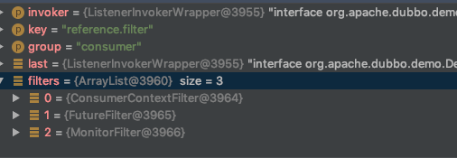
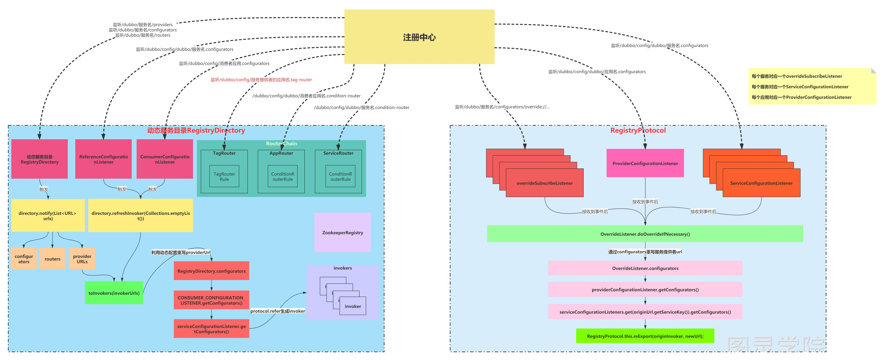

# 给@Reference注解创建代理对象

当Spring启动过程中，会去给@Reference注解标注了的属性去进行赋值，赋值的对象为ReferenceBean中get()方法所返回的对象，这个对象是一个代理对象

对于ReferenceBean，它表示应用想要引入的服务的信息，在执行get()时会做如下几步：

1. 调用checkAndUpdateSubConfigs()，检查和更新参数，和服务提供者类似，把ReferenceBean里的属性的值更新为优先级最高的参数值
2. 调用init()去生成代理对象ref，get()方法会返回这个ref
3. 在生成代理对象ref之前，先把消费者所引入服务设置的参数添加到一个map中，等会根据这个map中的参数去从注册中心查找服务
4. 把消费者配置的所有注册中心获取出来

1. 1. 如果只有一个注册中心，那么直接调用Protocol的refer(interfaceClass, urls.get(0));得到一个Invoker对象
   2. 如果有多个注册中心，则遍历每个注册中心，分别调用Protocol的refer(interfaceClass, url);得到一个Invoker对象添加到invokers中，然后把invokers调用CLUSTER.join(new StaticDirectory(u, invokers));封装所有invokers得到一个invoker，

把最终得到的invoker对象调用PROXY_FACTORY.getProxy(invoker);得到一个代理对象，并返回，这个代理对象就是ref

总结：上文的Invoker对象，表示服务执行者，从注册中心refer下来的是一个服务执行者，合并invokers后得到的invoker也是一个服务执行者（抽象范围更大了）

```java
public synchronized T get() {
    // 调用checkAndUpdateSubConfigs()，检查和更新参数，和服务提供者类似，把ReferenceBean里的属性的值更新为优先级最高的参数值
    checkAndUpdateSubConfigs();

    if (destroyed) {
        throw new IllegalStateException("The invoker of ReferenceConfig(" + url + ") has already destroyed!");
    }
    if (ref == null) {
        // 调用init()去生成代理对象ref，get()方法会返回这个ref
        init();
    }
    return ref;  // Invoke代理
}
```

调用init()去生成代理对象ref，get()方法会返回这个ref

```java
private void init() {
    //判断是否已经初始化，get方法是同步方法，所以只需直接判断标志位initialized即可
    if (initialized) {
        return;
    }

    //判断配置的interface是否正确
    checkStubAndLocal(interfaceClass);
    //判断-D参数配置或者配置文件是否配置是直连提供者
    checkMock(interfaceClass);
    // 在生成代理对象ref之前，先把消费者所引入服务设置的参数添加到一个map中，等会根据这个map中的参数去从注册中心查找服务
    Map<String, String> map = new HashMap<String, String>();

    map.put(SIDE_KEY, CONSUMER_SIDE);

    appendRuntimeParameters(map);
    if (!ProtocolUtils.isGeneric(getGeneric())) {
        String revision = Version.getVersion(interfaceClass, version);
        if (revision != null && revision.length() > 0) {
            map.put(REVISION_KEY, revision);
        }

        String[] methods = Wrapper.getWrapper(interfaceClass).getMethodNames();
        if (methods.length == 0) {
            logger.warn("No method found in service interface " + interfaceClass.getName());
            map.put(METHODS_KEY, ANY_VALUE);
        } else {
            map.put(METHODS_KEY, StringUtils.join(new HashSet<String>(Arrays.asList(methods)), COMMA_SEPARATOR));
        }
    }
    map.put(INTERFACE_KEY, interfaceName);
    appendParameters(map, metrics);
    appendParameters(map, application);
    appendParameters(map, module);
    // remove 'default.' prefix for configs from ConsumerConfig
    // appendParameters(map, consumer, Constants.DEFAULT_KEY);
    appendParameters(map, consumer);
    appendParameters(map, this);

    Map<String, Object> attributes = null;
    if (CollectionUtils.isNotEmpty(methods)) {
        attributes = new HashMap<String, Object>();
        for (MethodConfig methodConfig : methods) {
            appendParameters(map, methodConfig, methodConfig.getName());
            String retryKey = methodConfig.getName() + ".retry";
            if (map.containsKey(retryKey)) {
                String retryValue = map.remove(retryKey);
                if ("false".equals(retryValue)) {
                    map.put(methodConfig.getName() + ".retries", "0");
                }
            }

            attributes.put(methodConfig.getName(), convertMethodConfig2AsyncInfo(methodConfig));
        }
    }

    String hostToRegistry = ConfigUtils.getSystemProperty(DUBBO_IP_TO_REGISTRY);
    if (StringUtils.isEmpty(hostToRegistry)) {
        hostToRegistry = NetUtils.getLocalHost();
    } else if (isInvalidLocalHost(hostToRegistry)) {
        throw new IllegalArgumentException("Specified invalid registry ip from property:" + DUBBO_IP_TO_REGISTRY + ", value:" + hostToRegistry);
    }
    map.put(REGISTER_IP_KEY, hostToRegistry);

    // 创建远程服务的本地代理
    ref = createProxy(map);

    String serviceKey = URL.buildKey(interfaceName, group, version);
    ApplicationModel.initConsumerModel(serviceKey, buildConsumerModel(serviceKey, attributes));
    initialized = true;
}
```

创建远程服务的本地代理

把消费者配置的所有注册中心获取出来

1. 如果只有一个注册中心，那么直接调用Protocol的refer(interfaceClass, urls.get(0));得到一个Invoker对象
2. 如果有多个注册中心，则遍历每个注册中心，分别调用Protocol的refer(interfaceClass, url);得到一个Invoker对象添加到invokers中，然后把invokers调用CLUSTER.join(new StaticDirectory(u, invokers));封装所有invokers得到一个invoker

```java
private T createProxy(Map<String, String> map) {
    if (shouldJvmRefer(map)) {
        // injvm://
        URL url = new URL(LOCAL_PROTOCOL, LOCALHOST_VALUE, 0, interfaceClass.getName()).addParameters(map);
        invoker = REF_PROTOCOL.refer(interfaceClass, url);
        if (logger.isInfoEnabled()) {
            logger.info("Using injvm service " + interfaceClass.getName());
        }
    } else {
        // 为什么会有urls，因为可以在@Reference的url属性中配置多个url，可以是点对点的服务地址，也可以是注册中心的地址
        urls.clear(); // reference retry init will add url to urls, lead to OOM
        // @Reference中指定了url属性，如果配置了url，则不从registry中获取，直接使用配置的url
        if (url != null && url.length() > 0) { // user specified URL, could be peer-to-peer address, or register center's address.
            String[] us = SEMICOLON_SPLIT_PATTERN.split(url); // 用;号切分
            if (us != null && us.length > 0) {
                for (String u : us) {
                    URL url = URL.valueOf(u);
                    if (StringUtils.isEmpty(url.getPath())) {
                        url = url.setPath(interfaceName);
                    }

                    // 如果是注册中心地址，则在url中添加一个refer参数
                    if (REGISTRY_PROTOCOL.equals(url.getProtocol())) {
                        // map表示消费者端配置的参数
                        urls.add(url.addParameterAndEncoded(REFER_KEY, StringUtils.toQueryString(map)));
                    } else {
                        // 如果是服务地址
                        // 有可能url中配置了参数，map中表示的服务消费者消费服务时的参数，所以需要合并
                        urls.add(ClusterUtils.mergeUrl(url, map));
                    }
                }
            }
        } else { // assemble URL from register center's configuration
            // @Reference中的protocol属性表示使用哪个协议调用服务，如果不是本地调用协议injvm://，则把注册中心地址找出来
            // 对于injvm://协议已经在之前的逻辑中就已经生成invoke了
            // if protocols not injvm checkRegistry
            if (!LOCAL_PROTOCOL.equalsIgnoreCase(getProtocol())){
                checkRegistry();
                // 把消费者配置的所有注册中心获取出来
                List<URL> us = loadRegistries(false);
                if (CollectionUtils.isNotEmpty(us)) {
                    for (URL u : us) {
                        URL monitorUrl = loadMonitor(u);
                        if (monitorUrl != null) {
                            map.put(MONITOR_KEY, URL.encode(monitorUrl.toFullString()));
                        }
                        // 对于注册中心地址都添加REFER_KEY
                        urls.add(u.addParameterAndEncoded(REFER_KEY, StringUtils.toQueryString(map)));
                    }
                }
                if (urls.isEmpty()) {
                    throw new IllegalStateException("No such any registry to reference " + interfaceName + " on the consumer " + NetUtils.getLocalHost() + " use dubbo version " + Version.getVersion() + ", please config <dubbo:registry address=\"...\" /> to your spring config.");
                }
            }
        }

        // 如果只有一个url则直接refer得到一个invoker
        if (urls.size() == 1) {
            // RegistryProtocol.refer() 或者 DubboProtocol.refer()
            invoker = REF_PROTOCOL.refer(interfaceClass, urls.get(0));
            // MockClusterInvoker-->FailoverClusterInvoker-->RegistryDirectory
            //                                                          --->RegistryDirectory$InvokerDelegate-->ListenerInvokerWrapper-->ProtocolFilterWrapper$CallbackRegistrationInvoker-->ConsumerContextFilter-->FutureFilter-->MonitorFilter-->AsyncToSyncInvoker-->DubboInvoker
        } else {
            // 如果有多个url
            // 1. 根据每个url，refer得到对应的invoker
            // 2. 如果这多个urls中存在注册中心url，则把所有invoker整合为RegistryAwareClusterInvoker，该Invoker在调用时，会查看所有Invoker中是否有默认的，如果有则使用默认的Invoker，如果没有，则使用第一个Invoker
            // 2. 如果这多个urls中不存在注册中心url，则把所有invoker整合为FailoverCluster

            List<Invoker<?>> invokers = new ArrayList<Invoker<?>>();
            URL registryURL = null; // 用来记录urls中最后一个注册中心url
            for (URL url : urls) {
                invokers.add(REF_PROTOCOL.refer(interfaceClass, url));

                if (REGISTRY_PROTOCOL.equals(url.getProtocol())) {
                    registryURL = url; // use last registry url
                }
            }

            // 如果存在注册中心地址
            if (registryURL != null) { // registry url is available
                // use RegistryAwareCluster only when register's CLUSTER is available
                URL u = registryURL.addParameter(CLUSTER_KEY, RegistryAwareCluster.NAME);
                // StaticDirectory表示静态服务目录，里面的invokers是不会变的, 生成一个RegistryAwareCluster
                // The invoker wrap relation would be: RegistryAwareClusterInvoker(StaticDirectory) -> FailoverClusterInvoker(RegistryDirectory, will execute route) -> Invoker
                invoker = CLUSTER.join(new StaticDirectory(u, invokers));
            } else { // not a registry url, must be direct invoke.
                // 如果不存在注册中心地址, 生成一个FailoverClusterInvoker
                invoker = CLUSTER.join(new StaticDirectory(invokers));
            }
        }
    }

    if (shouldCheck() && !invoker.isAvailable()) {
        throw new IllegalStateException("Failed to check the status of the service " + interfaceName + ". No provider available for the service " + (group == null ? "" : group + "/") + interfaceName + (version == null ? "" : ":" + version) + " from the url " + invoker.getUrl() + " to the consumer " + NetUtils.getLocalHost() + " use dubbo version " + Version.getVersion());
    }
    if (logger.isInfoEnabled()) {
        logger.info("Refer dubbo service " + interfaceClass.getName() + " from url " + invoker.getUrl());
    }
    /**
     * @since 2.7.0
     * ServiceData Store
     */
    MetadataReportService metadataReportService = null;
    if ((metadataReportService = getMetadataReportService()) != null) {
        URL consumerURL = new URL(CONSUMER_PROTOCOL, map.remove(REGISTER_IP_KEY), 0, map.get(INTERFACE_KEY), map);
        metadataReportService.publishConsumer(consumerURL);
    }
    // create service proxy
    // 把最终得到的invoker对象调用PROXY_FACTORY.getProxy(invoker);得到一个代理对象，并返回，这个代理对象就是ref
    return (T) PROXY_FACTORY.getProxy(invoker);
}
```

# refer引用服务

接下来，来看Protorol.refer(interfaceClass, url)方法是怎么生成一个Invoker的

1. 首先interfaceClass表示要引入的服务接口，url是注册中心的url（registry://），该url中有一个refer参数，参数值为当前所要引入服务的参数
2. 调用doRefer(**cluster**, registry, type, url)
3. 在doRefer方法中会生成一个RegistryDirectory
4. 然后获取新版本中的路由器链，并添加到RegistryDirectory中去
5. RegistryDirectory监听几个目录（注意，完成监听器的订阅绑定后，**会自动触发一次去获取这些目录上的当前数据**）

1. 1. 当前所引入的服务的动态配置目录：/dubbo/config/dubbo/org.apache.dubbo.demo.DemoService:1.1.1:g1.configurators
   2. 当前所引入的服务的提供者目录：/dubbo/org.apache.dubbo.demo.DemoService/providers
   3. 当前所引入的服务的老版本动态配置目录：/dubbo/org.apache.dubbo.demo.DemoService/configurators
   4. 当前所引入的服务的老版本路由器目录：/dubbo/org.apache.dubbo.demo.DemoService/routers

1. 调用cluster.join(directory)得到一个invoker
2. 返回invoker（如果消费者引入了多个group中的服务，那么这里返回的是new MergeableClusterInvoker<T>(directory);，否则返回的是new FailoverClusterInvoker<T>(directory);）
3. 但是，上面返回的两个Invoker都会被MockClusterInvoker包装，所以最终返回的是MockClusterInvoker。

REF_PROTOCOL是 Protocol 接口的自适应扩展代理类

```java
private static final Protocol REF_PROTOCOL = ExtensionLoader.getExtensionLoader(Protocol.class).getAdaptiveExtension();
```

调用其 refer 方法，会在参数 URL 中查询到 protocol="register"值，也就是执行 RegistryProtocol扩展实现类，但是同服务导出一样，也会有 AOP 包装类

首先执行ProtocolFilterWrapper包装类：

```java
@Override
public <T> Invoker<T> refer(Class<T> type, URL url) throws RpcException {
    if (REGISTRY_PROTOCOL.equals(url.getProtocol())) {  // dubbo://
        return protocol.refer(type, url);
    }
    return buildInvokerChain(protocol.refer(type, url), REFERENCE_FILTER_KEY, CommonConstants.CONSUMER);
}
```

再执行ProtocolListenerWrapper包装类：

```java
@Override
public <T> Invoker<T> refer(Class<T> type, URL url) throws RpcException {
    if (REGISTRY_PROTOCOL.equals(url.getProtocol())) {  // dubbo://
        return protocol.refer(type, url);
    }
    return new ListenerInvokerWrapper<T>(protocol.refer(type, url),
            Collections.unmodifiableList(
                    ExtensionLoader.getExtensionLoader(InvokerListener.class)
                            .getActivateExtension(url, INVOKER_LISTENER_KEY)));
}
```

上述包装类都没有特殊处理

最终执行 RegistryProtocol

```java
@Override
@SuppressWarnings("unchecked")
public <T> Invoker<T> refer(Class<T> type, URL url) throws RpcException {

    // 从registry://的url中获取对应的注册中心，比如zookeeper， 默认为dubbo，dubbo提供了自带的注册中心实现
    // url由 registry:// 改变为---> zookeeper://
    url = URLBuilder.from(url)
            .setProtocol(url.getParameter(REGISTRY_KEY, DEFAULT_REGISTRY))
            .removeParameter(REGISTRY_KEY)
            .build();

    // 拿到注册中心实现，ZookeeperRegistry
    Registry registry = registryFactory.getRegistry(url);

    // 下面这个代码，通过过git历史提交记录是用来解决SimpleRegistry不可用的问题
    if (RegistryService.class.equals(type)) {
        return proxyFactory.getInvoker((T) registry, type, url);
    }

    // qs表示 queryString, 表示url中的参数，表示消费者引入服务时所配置的参数
    Map<String, String> qs = StringUtils.parseQueryString(url.getParameterAndDecoded(REFER_KEY));

    // group="a,b" or group="*"
    // https://dubbo.apache.org/zh/docs/v2.7/user/examples/group-merger/
    String group = qs.get(GROUP_KEY);
    if (group != null && group.length() > 0) {
        if ((COMMA_SPLIT_PATTERN.split(group)).length > 1 || "*".equals(group)) {
            // group有多个值，这里的cluster为MergeableCluster
            return doRefer(getMergeableCluster(), registry, type, url);
        }
    }

    // 这里的cluster是cluster的Adaptive对象,扩展点
    return doRefer(cluster, registry, type, url);
}
```

```java
private <T> Invoker<T> doRefer(Cluster cluster, Registry registry, Class<T> type, URL url) {
    // RegistryDirectory表示动态服务目录，会和注册中心的数据保持同步
    // type表示一个服务对应一个RegistryDirectory，url表示注册中心地址
    // 在消费端，最核心的就是RegistryDirectory
    RegistryDirectory<T> directory = new RegistryDirectory<T>(type, url);
    directory.setRegistry(registry);
    directory.setProtocol(protocol);


    // all attributes of REFER_KEY
    // 引入服务所配置的参数
    Map<String, String> parameters = new HashMap<String, String>(directory.getUrl().getParameters());

    // 消费者url
    URL subscribeUrl = new URL(CONSUMER_PROTOCOL, parameters.remove(REGISTER_IP_KEY), 0, type.getName(), parameters);
    if (!ANY_VALUE.equals(url.getServiceInterface()) && url.getParameter(REGISTER_KEY, true)) {
        directory.setRegisteredConsumerUrl(getRegisteredConsumerUrl(subscribeUrl, url));

        // 注册简化后的消费url
        registry.register(directory.getRegisteredConsumerUrl());
    }

    // 构造路由链,路由链会在引入服务时按路由条件进行过滤
    // 路由链是动态服务目录中的一个属性，通过路由链可以过滤某些服务提供者
    directory.buildRouterChain(subscribeUrl);

    // 服务目录需要订阅的几个路径
    // 当前应用所对应的动态配置目录：/dubbo/config/dubbo/dubbo-demo-consumer-application.configurators
    // 当前所引入的服务的动态配置目录：/dubbo/config/dubbo/org.apache.dubbo.demo.DemoService:1.1.1:g1.configurators
    // 当前所引入的服务的提供者目录：/dubbo/org.apache.dubbo.demo.DemoService/providers
    // 当前所引入的服务的老版本动态配置目录：/dubbo/org.apache.dubbo.demo.DemoService/configurators
    // 当前所引入的服务的老版本路由器目录：/dubbo/org.apache.dubbo.demo.DemoService/routers
    directory.subscribe(subscribeUrl.addParameter(CATEGORY_KEY,
            PROVIDERS_CATEGORY + "," + CONFIGURATORS_CATEGORY + "," + ROUTERS_CATEGORY));

    // 利用传进来的cluster，join得到invoker, MockClusterWrapper
    Invoker invoker = cluster.join(directory);
    ProviderConsumerRegTable.registerConsumer(invoker, url, subscribeUrl, directory);
    return invoker;
}
```

# 注册消费者 URL

通过调用 ZookeeperRegistry 的 register，将消费者 URL 注册到 zk 上，最终由ZookeeperRegistry 的父类FailbackRegistry执行

```java
@Override
public void register(URL url) {
    super.register(url);
    removeFailedRegistered(url);
    removeFailedUnregistered(url);
    try {
        // Sending a registration request to the server side
        doRegister(url);
    } catch (Exception e) {
        Throwable t = e;

        // If the startup detection is opened, the Exception is thrown directly.
        boolean check = getUrl().getParameter(Constants.CHECK_KEY, true)
                && url.getParameter(Constants.CHECK_KEY, true)
                && !CONSUMER_PROTOCOL.equals(url.getProtocol());
        boolean skipFailback = t instanceof SkipFailbackWrapperException;
        if (check || skipFailback) {
            if (skipFailback) {
                t = t.getCause();
            }
            throw new IllegalStateException("Failed to register " + url + " to registry " + getUrl().getAddress() + ", cause: " + t.getMessage(), t);
        } else {
            logger.error("Failed to register " + url + ", waiting for retry, cause: " + t.getMessage(), t);
        }

        // Record a failed registration request to a failed list, retry regularly
        addFailedRegistered(url);
    }
}
```

模板设计模式，最终由子类ZookeeperRegistry 完成服务的注册

```java
@Override
public void doRegister(URL url) {
  try {
    zkClient.create(toUrlPath(url), url.getParameter(DYNAMIC_KEY, true));
  } catch (Throwable e) {
    throw new RpcException("Failed to register " + url + " to zookeeper " + getUrl() + ", cause: " + e.getMessage(), e);
  }
}
```

# 新版本构造路由链

RouterChain.buildChain(url)方法赋值得到路由链。

这里的url是这样的：consumer://192.168.0.100/org.apache.dubbo.demo.DemoService?application=dubbo-demo-consumer-application&dubbo=2.0.2&group=g1&interface=org.apache.dubbo.demo.DemoService&lazy=false&methods=sayHello&pid=19852&release=2.7.0&revision=1.1.1&side=consumer&sticky=false&timestamp=1591332529643&version=1.1.1

表示所引入的服务的参数，在获得路由链时就要根据这些参数去匹配得到符合当前的服务的Router.

1. RouterChain.buildChain(url)
2. new RouterChain<>(url)
3. List<RouterFactory> extensionFactories = ExtensionLoader.getExtensionLoader(RouterFactory.class).getActivateExtension(url, (String[]) null);根据url去获取可用的RouterFactory，可以拿到四个：

1. 1. MockRouterFactory：Mock路由，没有order，相当于order=0
   2. TagRouterFactory: 标签路由，order = 100
   3. AppRouterFactory: 应用条件路由，order = 200
   4. ServiceRouterFactory: 服务条件路由，order = 300

4. 遍历每个RouterFactory，调用getRouter(url)方法得到Router，存到List<Router> routers中

5. 对routers按order从小到大的顺序进行排序

```java
public void buildRouterChain(URL url) {
    this.setRouterChain(RouterChain.buildChain(url));
}
```

```java
public static <T> RouterChain<T> buildChain(URL url) {
    return new RouterChain<>(url);
}

private RouterChain(URL url) {
    // 拿到RouterFactory接口有哪些扩展实现类，比如默认情况下就有四个：
    // 0 = {MockRouterFactory@2880}
    // 1 = {TagRouterFactory@2881}      // 标签路由
    // 2 = {AppRouterFactory@2882}      // 应用条件路由
    // 3 = {ServiceRouterFactory@2883}  // 服务条件路由
    List<RouterFactory> extensionFactories = ExtensionLoader.getExtensionLoader(RouterFactory.class)
            .getActivateExtension(url, (String[]) null);

    // 然后利用RouterFactory根据url生成各个类型的Router
    // 这里生产的routers已经是真实可用的了，但是有个比较特殊的：
    // 对于应用条件路由和服务条件路由对于的Router对象，对象内部已经有真实可用的数据了（数据已经从配置中心得到了）
    // 但是对于标签路由则没有，它暂时还相当于一个没有内容的对象（还没有从配置中心获取标签路由的数据）
    List<Router> routers = extensionFactories.stream()
            .map(factory -> factory.getRouter(url))
            .collect(Collectors.toList());

    // 把routers按priority进行排序
    initWithRouters(routers);
}
```

AppRouter和ServiceRouter是非常类似，他们的父类都是ListenableRouter，在创建AppRouter和ServiceRouter时，会绑定一个监听器，比如：

1. AppRouter监听的是：/dubbo/config/dubbo/dubbo-demo-consumer-application.condition-router节点的内容
2. ServiceRouter监听的是：/dubbo/config/dubbo/org.apache.dubbo.demo.DemoService:1.1.1:g1.condition-router节点的内容

绑定完监听器之后，会主动去获取一下对应节点的内容（也就是所配置的路由规则内容），然后会去解析内容得到ConditionRouterRule routerRule，再调用generateConditions(routerRule);方法解析出一个或多个ConditionRouter，并存入到List<ConditionRouter> conditionRouters中

注意routerRule和conditionRouters是ListenableRouter的属性，就是在AppRouter和ServiceRouter中的。

对于TagRouter就比较特殊，首先标签路由是用在，当消费者在调用某个服务时，通过在请求中设置标签，然后根据所设置的标签获得可用的服务提供者地址。而且目前TagRouter只支持应用级别的配置(而且是服务提供者应用，给某个服务提供者应用打标)。

所以对于服务消费者而言，在引用某个服务时，需要知道提供这个服务的应用名，然后去监听这个应用名对应的.tag-router节点内容，比如/dubbo/config/dubbo/dubbo-demo-provider-application.tag-router。

那么问题来了，怎么才能知道提供这个服务的服务提供者的应用名呢？

答案是，需要先获取到当前所引入服务的服务提供者URL，从URL中得到服务提供者的应用名。

拿到应用名之后才能去应用名对应的.tag-router节点去绑定监听器。

这就是TagRouter和AppRouter、ServiceRouter的区别，对于AppRouter而言，监听的是本消费者应用的路由规则，对于ServiceRouter而言，监听的是所引入服务的路由规则，都比较简单。

**所以，TagRouter是在引入服务时，获取到服务的提供者URL之后，才会去监听.tag-router节点中的内容，并手动获取一次节点中的内容，设置TagRouter对象中tagRouterRule属性，表示标签路由规则。**

# 服务目录

消费端每个服务对应一个服务目录RegistryDirectory

一个服务目录中包含了：

1. serviceType：表示服务接口
2. serviceKey：表示引入的服务key，serviceclass+version+group
3. queryMap：表示引入的服务的参数配置
4. configurators：动态配置
5. routerChain：路由链
6. invokers：表示服务目录当前缓存的服务提供者Invoker
7. ConsumerConfigurationListener：监听本应用的动态配置
8. ReferenceConfigurationListener：监听所引入的服务的动态配置

当ConsumerConfigurationListener接收到了消费者应用的动态配置数据变化后，会调用当前消费者应用中的所有RegistryDirectory的refreshInvoker()方法，表示刷新消费者应用中引入的每个服务对应的Invoker

当ReferenceConfigurationListener接收到了某个服务的动态配置数据变化后，会调用该服务对应的RegistryDirectory的refreshInvoker()方法，表示刷新该服务对应的Invoker

当AppRouter和ServiceRouter接收到条件路由的数据变化后，就会更新Router内部的routerRule和conditionRouters属性。这两个属性在服务调用过程中会用到。

当TagRouter接收到标签路由的数据变化后，就会更新TagRouter内部的tagRouterRule的属性，这个属性在服务调用过程中会用到。

# 获取服务 Invoker

RegistryDirectory监听几个目录（注意，完成监听器的订阅绑定后，**会自动触发一次去获取这些目录上的当前数据**）

```java
@Override
public synchronized void notify(List<URL> urls) {
    Map<String, List<URL>> categoryUrls = urls.stream()
            .filter(Objects::nonNull)
            .filter(this::isValidCategory)
            .filter(this::isNotCompatibleFor26x)
            .collect(Collectors.groupingBy(url -> {
                if (UrlUtils.isConfigurator(url)) {
                    return CONFIGURATORS_CATEGORY;
                } else if (UrlUtils.isRoute(url)) {
                    return ROUTERS_CATEGORY;
                } else if (UrlUtils.isProvider(url)) {
                    return PROVIDERS_CATEGORY;
                }
                return "";
            }));

    // 获取动态配置URL，生成configurators
    List<URL> configuratorURLs = categoryUrls.getOrDefault(CONFIGURATORS_CATEGORY, Collections.emptyList());
    this.configurators = Configurator.toConfigurators(configuratorURLs).orElse(this.configurators);

    // 获取老版本路由URL，生成Router，并添加到路由链中
    List<URL> routerURLs = categoryUrls.getOrDefault(ROUTERS_CATEGORY, Collections.emptyList());
    toRouters(routerURLs).ifPresent(this::addRouters);

    // 获取服务提供者URL
    List<URL> providerURLs = categoryUrls.getOrDefault(PROVIDERS_CATEGORY, Collections.emptyList());
    refreshOverrideAndInvoker(providerURLs);
}
```

当RegistryDirectory接收到"/dubbo/org.apache.dubbo.demo.DemoService/**providers**"节点数据变化后，会调用refreshOverrideAndInvoker()方法。这个方法就是用来针对每个服务提供者来生成Invoker的

1. refreshOverrideAndInvoker方法中首先调用overrideDirectoryUrl()方法利用Configurators重写目录地址，目录地址是这样的：zookeeper://127.0.0.1:2181/org.apache.dubbo.registry.RegistryService?application=dubbo-demo-consumer-application&dubbo=2.0.2&group=g1&interface=org.apache.dubbo.demo.DemoService&lazy=false&methods=sayHello&pid=49964&register.ip=192.168.40.17&release=2.7.0&revision=1.1.1&side=consumer&sticky=false&timestamp=1591339005022&version=1.1.1，在注册中心URL基础上把当前引入服务的参数作为URL的Parameters，所以这个地址既包括了注册中心的信息，也包括了当前引入服务的信息
2. 利用老版本configurators，Consumer应用的configurators，引入的服务的configurators去重写目录地址。
3. 重写往目录地址后，调用refreshInvoker(urls)方法去刷新Invoker
4. 在refreshInvoker(urls)方法中会把从注册中心获取到的providers节点下的服务URL，调用toInvokers(invokerUrls)方法得到Invoker
5. 先按Protocol进行过滤，并且调用DubboProtocol.refer方法得到Invoker
6. 将得到的invokers设置到RouterChain上，并且调用RouterChain上所有的**routers的**notify(**invokers**)方法，实际上这里只有TagRouter的notify方法有用
7. 再把属于同一个group中的invoker合并起来
8. 这样Invoker就生成好了

```java
private Map<String, Invoker<T>> toInvokers(List<URL> urls) {
    Map<String, Invoker<T>> newUrlInvokerMap = new HashMap<>();
    if (urls == null || urls.isEmpty()) {
        return newUrlInvokerMap;
    }
    Set<String> keys = new HashSet<>();
    String queryProtocols = this.queryMap.get(PROTOCOL_KEY);

    // 遍历当前服务所有的服务提供者URL
    for (URL providerUrl : urls) {
        // If protocol is configured at the reference side, only the matching protocol is selected
        if (queryProtocols != null && queryProtocols.length() > 0) {
            boolean accept = false;
            String[] acceptProtocols = queryProtocols.split(",");

            // 当前消费者如果手动配置了Protocol，那么则进行匹配
            for (String acceptProtocol : acceptProtocols) {
                if (providerUrl.getProtocol().equals(acceptProtocol)) {
                    accept = true;
                    break;
                }
            }
            if (!accept) {
                continue;
            }
        }
        if (EMPTY_PROTOCOL.equals(providerUrl.getProtocol())) {
            continue;
        }

        // 当前Protocol是否在应用中存在对应的扩展点
        if (!ExtensionLoader.getExtensionLoader(Protocol.class).hasExtension(providerUrl.getProtocol())) {
            logger.error(new IllegalStateException("Unsupported protocol " + providerUrl.getProtocol() +
                    " in notified url: " + providerUrl + " from registry " + getUrl().getAddress() +
                    " to consumer " + NetUtils.getLocalHost() + ", supported protocol: " +
                    ExtensionLoader.getExtensionLoader(Protocol.class).getSupportedExtensions()));
            continue;
        }

        URL url = mergeUrl(providerUrl);

        String key = url.toFullString(); // The parameter urls are sorted
        if (keys.contains(key)) { // Repeated url
            continue;
        }
        keys.add(key);
        // Cache key is url that does not merge with consumer side parameters, regardless of how the consumer combines parameters, if the server url changes, then refer again
        Map<String, Invoker<T>> localUrlInvokerMap = this.urlInvokerMap; // local reference
        Invoker<T> invoker = localUrlInvokerMap == null ? null : localUrlInvokerMap.get(key);

        // 如果当前服务提供者URL没有生产过Invoker
        if (invoker == null) { // Not in the cache, refer again
            try {
                boolean enabled = true;
                if (url.hasParameter(DISABLED_KEY)) {
                    enabled = !url.getParameter(DISABLED_KEY, false);
                } else {
                    enabled = url.getParameter(ENABLED_KEY, true);
                }
                if (enabled) {
                    // 调用Protocol的refer方法得到一个Invoker   DubboProtocol.refer()
                    invoker = new InvokerDelegate<>(protocol.refer(serviceType, url), url, providerUrl);
                }
            } catch (Throwable t) {
                logger.error("Failed to refer invoker for interface:" + serviceType + ",url:(" + url + ")" + t.getMessage(), t);
            }
            if (invoker != null) { // Put new invoker in cache
                newUrlInvokerMap.put(key, invoker);
            }
        } else {
            newUrlInvokerMap.put(key, invoker);
        }
    }
    keys.clear();
    return newUrlInvokerMap;
}
```

首先执行ProtocolFilterWrapper包装类：

```java
@Override
public <T> Invoker<T> refer(Class<T> type, URL url) throws RpcException {
    if (REGISTRY_PROTOCOL.equals(url.getProtocol())) {  // dubbo://
        return protocol.refer(type, url);
    }
    return buildInvokerChain(protocol.refer(type, url), REFERENCE_FILTER_KEY, CommonConstants.CONSUMER);
}
```

再执行ProtocolListenerWrapper包装类：

```java
@Override
public <T> Invoker<T> refer(Class<T> type, URL url) throws RpcException {
    if (REGISTRY_PROTOCOL.equals(url.getProtocol())) {  // dubbo://
        return protocol.refer(type, url);
    }
    return new ListenerInvokerWrapper<T>(protocol.refer(type, url),
            Collections.unmodifiableList(
                    ExtensionLoader.getExtensionLoader(InvokerListener.class)
                            .getActivateExtension(url, INVOKER_LISTENER_KEY)));
}
```



# DubboProtocol的服务引入（Refer）

DubboProtocol中并没有refer方法，是在它的父类AbstractProtocol中才有的refer方法

```java
@Override
public <T> Invoker<T> refer(Class<T> type, URL url) throws RpcException {
	// 异步转同步Invoker , type是接口，url是服务地址
	// DubboInvoker是异步的，而AsyncToSyncInvoker会封装为同步的
	return new AsyncToSyncInvoker<>(protocolBindingRefer(type, url));
}
```


调用protocolBindingRefer()方法得到一个Invoker后，会包装为一个AsyncToSyncInvoker然后作为refer方法的结果返回。

在DubboProtocol的protocolBindingRefer()方法中会new一个DubboInvoker，然后就返回了。

在构造DubboInvoker时，有一个非常重要的步骤，构造clients。DubboInvoker作为消费端服务的执行者，在调用服务时，是需要去发送Invocation请求的，而发送请求就需要client，之所以有多个client，是因为DubboProtocol支持多个。

假如在一个DubboInvoker中有多个Client，那么在使用这个DubboInvoker去调用服务时，就可以提高效率，比如一个服务接口有多个方法，那么在业务代码中，可能会不断的调用该接口中的方法，并且由于DubboProtocol底层会使用异步去发送请求，所以在每次需要发送请求时，就可以从clients轮询一个client去发送这个数据，从而提高效率。

接下来，来看看clients是如何生成的

1. 首先，一个DubboInvoker到底支持多少个Client呢？这是可以配置的，参数为connections，按指定的数字调用initClient(url)得到ExchangeClient。
2. initClient(url)的实现逻辑为

1. 1. 获取client参数，表示是用netty还是mina等等
   2. 获取**codec参数，表示数据的编码方式**
   3. **获取****heartbeat参数，表示长连接的心跳时间，超过这个时间服务端没有收到数据则关闭socket，默认为1分钟**
   4. **如果所指定的client没有对应的扩展点，则抛异常**
   5. 获取**lazy参数，默认为false，如果为true，那么则直接返回一个**LazyConnectExchangeClient，表示真正在发送数据时才建立socket
   6. 否则调用Exchangers.*connect*(url, **requestHandler**)获得一个client
   7. 在connect()方法中调用HeaderExchanger的connect方法去建立socket连接并得到一个HeaderExchangeClient
   8. 在构造HeaderExchangeClient时需要先执行Transporters.*connect*()方法得到一个Client
   9. 会调用NettyTransporter的connect()去构造一个NettyClient
   10. 在构造NettyClient的过程中，会去初始化Netty的客户端，然后连接Server端，建立一个Socket连接

# Invoker总结

**MockClusterInvoker**： 完成Mock功能，由MockClusterWrapper生成，MockClusterWrapper是Cluster接口的包装类，通过Cluster.join()方法得到MockClusterInvoker

**FailoverClusterInvoker**：完成集群容错功能，是MockClusterInvoker的下级

**RegistryAwareClusterInvoker**：如果指定了多个注册中心，那么RegistryAwareClusterInvoker完成选择默认的注册中心的进行调用，如果没有指定默认的，则会遍历注册中心进行调用，如果该注册中心没有对应的服务则跳过。

**DubboInvoker**：完成Dubbo协议底层发送数据

**ProtocolFilterWrapper$CallbackRegistrationInvoker**：完成对filter的调用，ProtocolFilterWrapper是Protocol接口的包装类，通过Protocol.refer()方法得到CallbackRegistrationInvoke

# 流程图



